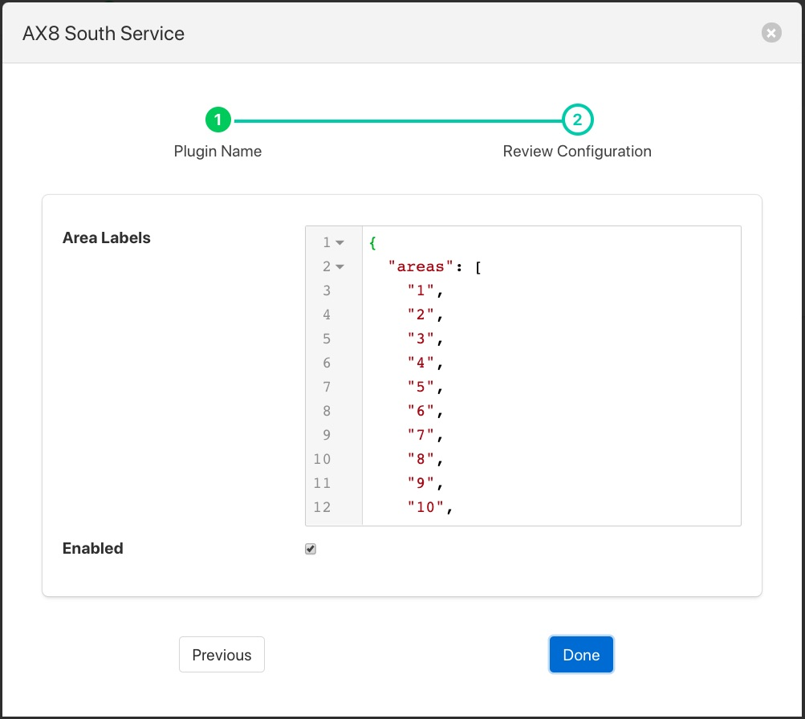

.. Images

.. Links
.. |FlirAX8| raw:: html

   <a href="../foglamp-south-FlirAX8/index.html">Flir AX8</a>

Flir Validity Filter
====================

The *foglamp-filter-Flir-Validity* plugin is a simple filter that filters out unused boxes and spot temperatures in the Flir temperature data stream. The filter also allows the naming of the boxes such that the data points added to the asset will use these names rather than the default box1, box2 etc.

Adding the filter to a |FlirAX8| south plugin you will receive a configuration screen as below

+------------+
| |validity| |
+------------+

The JSON document *Area Labels* can be used to set the labels to use for each of the boxes and replace the min1, min2 etc.
