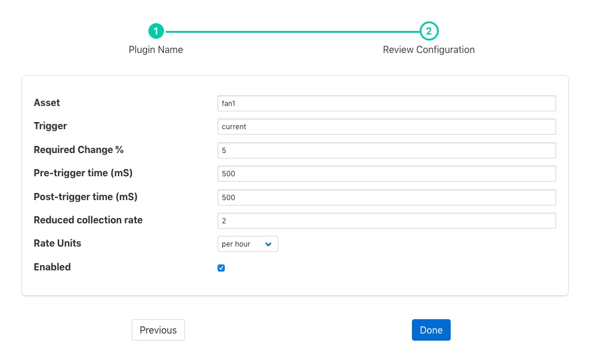

.. Images

Change Filter
=============

The *foglamp-filter-change* filter is used to only send information about an asset onward when a particular datapoint within that asset changes by more than a configured percentage. Data is sent for a period of time before and after the change in the monitored value. The amount of data to send before and after the change is configured in milliseconds, with a value for the pre-change time and one for the post-change time.

It is possible to define a rate at which readings should be sent regardless of the monitored value changing. This provides an average of the values of the period defined, e.g. send a 1 minute average of the values every minute.

This filter only operates on a single asset, all other assets are passed through the filter unaltered.

Change filters are added in the same way as any other filters.

  - Click on the Applications add icon for your service or task.

  - Select the *change* plugin from the list of available plugins.

  - Name your change filter.

  - Click *Next* and you will be presented with the following configuration page

    +----------+
    | |change| |
    +----------+

  - Enter the configuration for your change filter

    - **Asset**: The asset to monitor and control with this filter. This asset is both the asset that is used to look for changes and also the only asset whose data is affected by the triggered or non-triggered state of this filter.

    - **Trigger**: The datapoint within the asset that is used to trigger the sending of data at full rate. This datapoint may be either a numeric value or a string. If it is a string then a change of value of the defined change percentage or greater will trigger the sending of data. If the value is a string then any change in value will trigger the sending of the data.

    - **Required Change %**: The percentage change required for a numeric value change to trigger the sending of data. If this value is set to 0 then any change in the trigger value will be enough to trigger the sending of data.

    - **Pre-trigger time**: The number of milliseconds worth of data before the change that triggers the sending of data will be sent.

    - **Post-trigger time**: The number if milliseconds after a change that triggered the sending of data will be sent. If there is a subsequent change while the data is being sent then this period will be reset and the the sending of data will recommence.

    - **Reduced collection rate**: The rate at which to send averages if a change does not trigger full rate data. This is defined as a number of averages for a period defined in the rateUnit, e.g. 4 per hour.

    - **Rate Units**: The unit associated with the average rate above. This may be one of "per second", "per minute", "per hour" or "per day".

  - Enable the change filter and click on *Done* to activate your plugin

