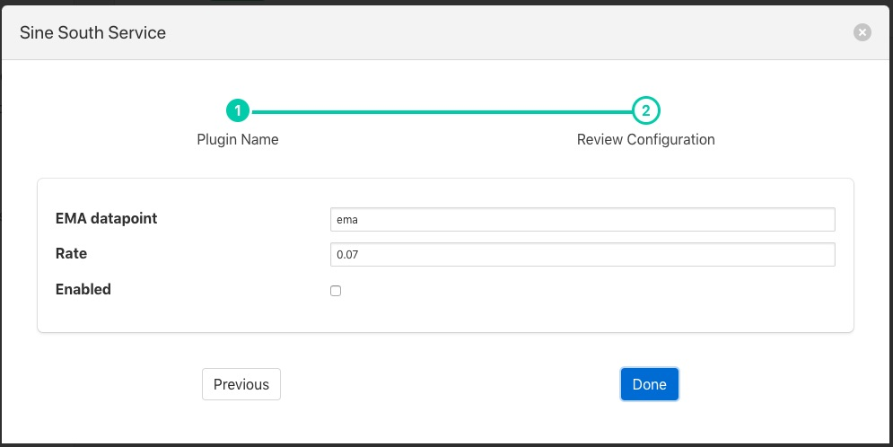

.. Images

Exponential Moving Average
==========================

The *foglamp-filter-ema* plugin implements an exponential moving average across a set of data. It also forms an example of how to write a filter plugin purely in Python. Filters written in Python have the same functionality and set of entry points as any other filter.

The plugin_info entry point that returns details of the plugin and the default configuration

.. code-block:: python

    def plugin_info():
        """ Returns information about the plugin
        Args:
        Returns:
            dict: plugin information
        Raises:
        """
        return {
            'name': 'ema',
            'version': '1.8.0',
            'mode': "none",
            'type': 'filter',
            'interface': '1.0',
            'config': _DEFAULT_CONFIG
        }

The plugin_init entry point that initialises the plugin

.. code-block:: python

    def plugin_init(config, ingest_ref, callback):
        """ Initialise the plugin
        Args:
            config: JSON configuration document for the Filter plugin configuration category
            ingest_ref:
            callback:
        Returns:
            data: JSON object to be used in future calls to the plugin

        ...
        return data

The plugin_reconfigure entry point that us called whenever the configuration is changed

.. code-block:: python

     def plugin_reconfigure(handle, new_config):
        """ Reconfigures the plugin
        Args:
            handle: handle returned by the plugin initialisation call
            new_config: JSON object representing the new configuration category for the category
        Returns:
            new_handle: new handle to be used in the future calls
        """
        global rate, datapoint
        ...
        return new_handle

The plugin_shutdown entry point called to terminate the plugin

.. code-block:: python

    def plugin_shutdown(handle):
        """ Shutdowns the plugin doing required cleanup.
        Args:
            handle: handle returned by the plugin initialisation call
        Returns:
            plugin shutdown
        """

And the plugin_ingest call that is called to do the actual data processing

.. code-block:: python

    def plugin_ingest(handle, data):
    """ Modify readings data and pass it onward
    Args:
        handle: handle returned by the plugin initialisation call
        data: readings data
    """

Python filters are added in the same way as any other filters.

  - Click on the Applications add icon for your service or task.

  - Select the *ema* plugin from the list of available plugins.

  - Name your ema filter.

  - Click *Next* and you will be presented with the following configuration page

+---------+
| |ema_1| |
+---------+

  - Configure your ema filter

    - **EMA datapoint**: The name of the data point to create within the asset

    - **Rate**: The rate controls the rate of the average generated, in this case it is the percentage the current value contribute to the average value.

  - Enable your plugin and click *Done*
