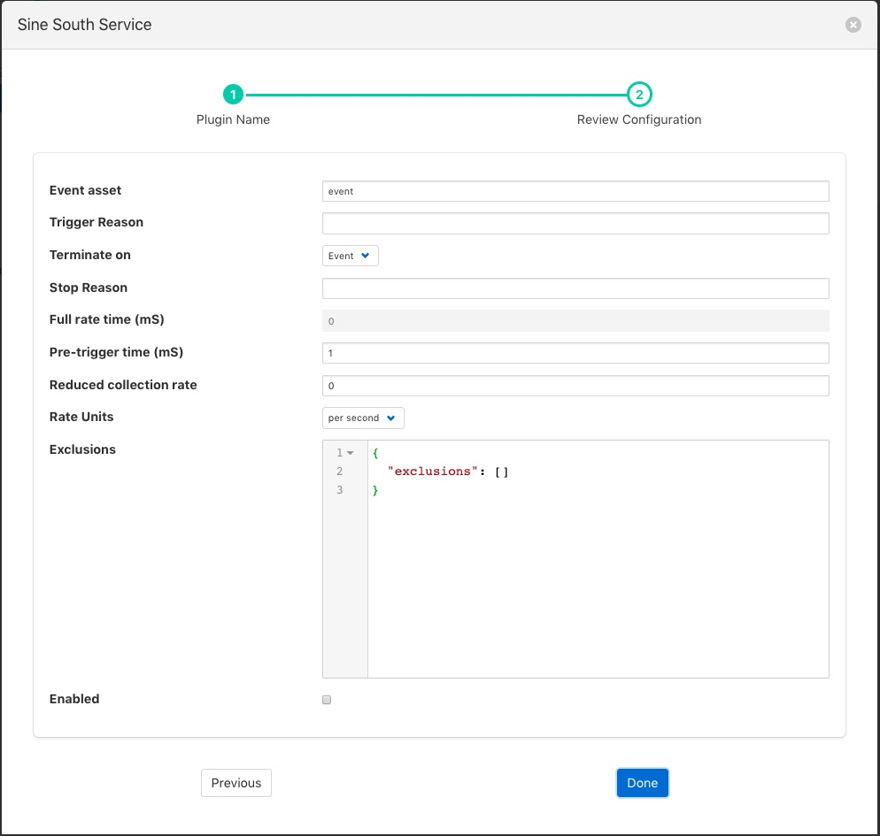
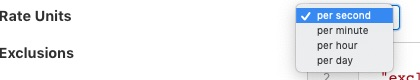

.. Images

.. Links
.. |assetDelivery| raw:: html

   <a href="../foglamp-notify-asset/index.html">asset notification delivery</a>

Event Rate Filter
=================

The *foglamp-filter-eventrate* is a filter plugin that has been explicitly designed to work with the
notification server, |assetDelivery| mechanism and the north service. It
can be used to reduce the rate a reading is sent northwards until an
interesting event occurs. The filter will read data at full rate from
the input side and buffer data internally, sending out averages for each
value over a time frame determined by the filter configuration.

The user will provide two strings and a notification asset name that will
be used to form a trigger for the filter. One trigger string will set
the trigger and the other will clear it. When the trigger is set then the
filter will no longer average the data over the configured time period,
but will instead send the full bandwidth data out of the filter.

The trigger strings are values in the event data point of the notification
asset that is named in the configuration. If the string given in the
trigger is found within the event data point then the trigger is deemed
to have fired. String matching is case sensitive, but strings given for
trigger do not need to be the entire event reason, sub string searching
is used to evaluate the trigger.

The filter also allows a pre-trigger time to be configured. In this
case it will buffer this much data internally and when the trigger is
initially set this pre-buffered data will be sent. The pre-buffered data
is discarded if the trigger is not set and the data gets to the defined
age for holding pre-trigger information.

Event rate filters are added in the same way as any other filters.

  - Click on the Applications add icon for your service or task.

  - Select the *eventrate* plugin from the list of available plugins.

  - Name your event rate filter.

  - Click *Next* and you will be presented with the following configuration page

+---------------+
| |eventrate_1| |
+---------------+

  - Configure your event rate filter 

    - **Event asset**: The asset used to trigger the full rate sending of data. This is the asset that is inserted by the |assetDelivery| plugin.
      
    - **Trigger Reason**: A trigger reason to set the trigger for full rate data

    - **Terminate on**: A switch to control if the end condition is a trigger or time based

    - **Step Reason**: An untrigger reason to clear the trigger for full rate data, if left blank this will simply be the trigger filter evaluating to false

    - **Full rate time (ms)**: A full rate time after which the reduce rate is again active

    - **Pre-trigger time (mS)**: An optional pre-trigger time expressed in milliseconds

    - **Reduced collection rate**: The nominal data rate to send data out. This defines the period over which is outgoing data item is averaged.

    - **Rate Units**: This defines the units used for the above rate. This can be per second, per minute, per hour or per day.

      +---------------+
      | |eventrate_2| |
      +---------------+

    - **Exclusions**: A set of asset names that are excluded from the rate limit processing and always sent at full rate

  - Enable your plugin and click *Done*
