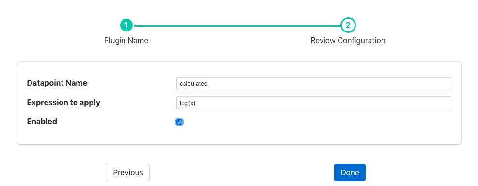

.. Images

.. Links
.. |exprtk| raw:: html

   <a href="http://www.partow.net/programming/exprtk/index.html">ExprTk</a>

Expression Filter
=================

The *foglamp-filter-expression* allows an arbitrary mathematical expression to be applied to data values. The expression filter allows user to augment the data at the edge to include values calculate from one or more asset to be added and acted upon both within the FogLAMP system itself, but also forwarded on to the up stream systems. Calculations can range from very simply manipulates of a single value to convert ranges, e.g. a linear scale to a logarithmic scale, or can combine multiple values to create composite value. E.g. create a power reading from voltage and current or work out a value that is normalized for speed.

Expression filters are added in the same way as any other filters.

  - Click on the Applications add icon for your service or task.

  - Select the *expression* plugin from the list of available plugins.

  - Name your expression filter.

  - Click *Next* and you will be presented with the following configuration page

+--------------+
| |expression| |
+--------------+

  - Configure the expression filter

    - **Datapoint Name**: The name of the new data point into which the new value will be stored.

    - **Expression to apply**: This is the expression that will be evaluated for each asset reading. The expression will use the data points within the reading as symbols within the asset. See `Expressions <#exprtk>`_ below.

  - Enable the plugin and click *Done* to activate your filter

.. _exprtk:

Expressions
-----------

The *foglamp-filter-expression* plugin makes use of the |exprtk| library to do run time expression evaluation. This library provides a rich mathematical operator set, the most useful of these in the context of this plugin are;

  - Logical operators (and, nand, nor, not, or, xor, xnor, mand, mor)

  - Mathematical operators (+, -, \*, /, %, ^)

  - Functions (min, max, avg, sum, abs, ceil, floor, round, roundn, exp, log, log10, logn, pow, root, sqrt, clamp, inrange, swap)

  - Trigonometry (sin, cos, tan, acos, asin, atan, atan2, cosh, cot, csc, sec, sinh, tanh, d2r, r2d, d2g, g2d, hyp)

Within the expression the data points of the asset become symbols that may be used; therefore if an asset contains values "voltage" and "current" the expression will contain those as symbols and an expression of the form

.. code-block:: console

   voltage * current

can be used to determine the power in Watts.

When the filter is used in an environment in which more than one asset is passing through the filter then symbols are created of the form <asset name>.<data point>. As an example if you have one asset called "electrical" that has data points of "voltage" and "current" and another asset called "speed" that has a data point called "rpm" then you can write an expression to obtain the power per 1000 RPM's of the motor as follows;

.. code-block:: console

   (electrical.voltage * electrical.current) / (speed.rpm / 1000)

