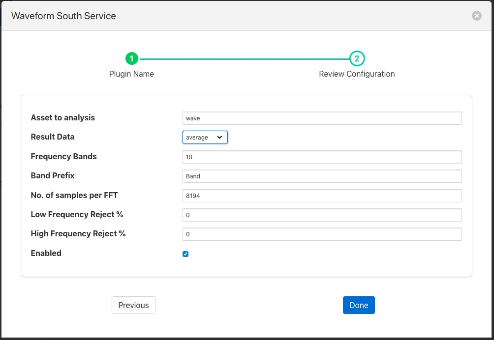
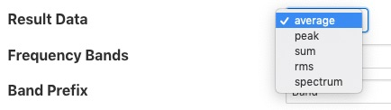

.. Images

Fast Fourier Transform Filter
=============================

The *foglamp-filter-fft* filter is designed to accept some periodic data such as a sample electrical waveform, audio data or vibration data and perform a Fast Fourier Transform on that data to supply frequency data about that waveform.

Data is added as a new asset which is named as the sampled asset with " FFT" append. This FFT asset contains a set of data points that each represent the a band of frequencies, or as a frequency spectrum in a single array data point. The band information that is returned by the filter can be chosen by the user. The options available to represent each band are; 

  - the average in the band, 

  - the peak
    
  - the RMS 
    
  - or the sum of the band.
    
The bands are created by dividing the frequency space into a number of equal ranges after first applying a low and high frequency filter to discard a percentage of the low and high frequency results. The bands are not created if the user instead opts to return the frequency spectrum.

If the low Pass filter is set to 15% and the high Pass filter is set to 10%, with the number of bands set to 5, the lower 15% of results are discarded and the upper 10% are discarded. The remaining 75% of readings are then divided into 5 equal bands, each of which representing 15% of the original result space. The results within each of the 15% bands are then averaged to produce a result for the frequency band.

FFT filters are added in the same way as any other filters.

  - Click on the Applications add icon for your service or task.

  - Select the *fft* plugin from the list of available plugins.

  - Name your FFT filter.

  - Click *Next* and you will be presented with the following configuration page

+---------+
| |fft_1| |
+---------+

  - Configure your FFT filter

    - **Asset to analysis**: The name of the asset that will be used as the input to the FFT algorithm.

    +---------+
    | |fft_2| |
    +---------+

    - **Result Data**: The data that should be returned for each band. This may be one of average, sum, peak, rms or spectrum. Selecting average will return the average amplitude within the band, sum returns the sum of all amplitudes within the frequency band, peak the greatest amplitude and rms the root mean square of the amplitudes within the band. Setting the output type to be spectrum will result in the full FFT spectrum data being written.  Spectrum data however can not be sent to all north destinations as it is not supported natively on all the systems FogLAMP can send data to.

    - **Frequency Bands**: The number of frequency bands to divide the resultant FFT output into

    - **Band Prefix**: The prefix to add to the data point names for each band in the output

    - **No. of Samples per FFT**: The number of input samples to use. This must be a power of 2.

    - **Low Frequency Reject %**: A percentage of low frequencies to discard, effectively reducing the range of frequencies to examine

    - **High Frequency Reject %**: A percentage of high frequencies to discard, effectively reducing the range of frequencies to examine
