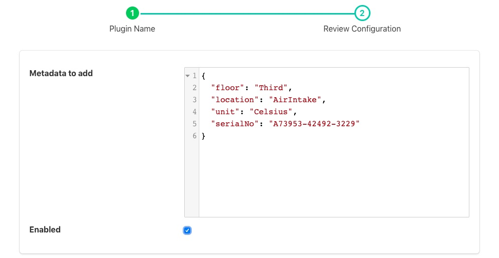

.. Images

Metadata Filter
===============

The *foglamp-filter-metadata* filter allows data to be added to assets within FogLAMP. Metadata takes the form of fixed data points that are added to an asset used to add context to the data. Examples of metadata might be unit of measurement information, location information or identifiers for the piece of equipment to which the measurement relates.

A metadata filter may be added to either a south service or a north task. In a south service it will be adding data for just those assets that originate in that service, in which case it probably relates to a single machine that is being monitored and would add metadata related to that machine. In a north task it causes metadata to be added to all assets that the FogLAMP is sending to the up stream system, in which case the metadata would probably related to that particular FogLAMP instance. Adding metadata in the north is particularly useful when a hierarchy of FogLAMP systems is used and an audit trail is required with the data or the individual FogLAMP systems related to some physical location information such s building, floor and/or site.

To add a metadata filter 

  - Click on the Applications add icon for your service or task.

  - Select the *metadata* plugin from the list of available plugins.

  - Name your metadata filter.

  - Click *Next* and you will be presented with the following configuration page

+------------+
| |metadata| |
+------------+

  - Enter your metadata in the JSON array shown. You may add multiple items in a single filter by separating them with commas. Each item takes the format of a JSON key/value pair and will be added as data points within the asset.

  - Enable the filter and click on *Done* to activate it

Example Metadata
----------------

Assume we are reading the temperature of air entering a paint booth. We might want to add the location of the paint booth, the booth number, the location of the sensor in the booth and the unit of measurement. We would add the following configuration value

.. code-block:: JSON

  {
    "value": {
        "floor": "Third",
        "booth": 1,
        "units": "C",
        "location": "AirIntake"
        }
  }

In above example the filter would add "floor", "booth", "units" and "location" data points to all the readings processed by it. Given an input to the filter of

.. code-block:: JSON

        { "temperature" : 23.4 }

The resultant reading that would be passed onward would become

.. code-block:: JSON

        { "temperature" : 23.5, "booth" : 1, "units" : "C", "floor" : "Third", "location" : "AirIntake" }

This is an example of how metadata might be added in a south service. Turning to the north now, assume we have a configuration whereby we have several sites in an organization and each site has several building. We want to monitor data about the buildings and install a FogLAMP instance in each building to collect building data. We also install a FogLAMP instance in each site to collect the data from each individual FogLAMP instance per building, this allows us to then send the site data to the head office without having to allow each building FogLAMP to have access to the corporate network. Only the site FogLAMP needs that access. We want to label the data to say which building it came from and also which site. We can do this by adding metadata at each stage.

To the north task of a building FogLAMP, for example the "Pearson" building, we add the following metadata

.. code-block:: JSON

   {
     "value" : {
         "building": "Pearson"
         }
   }

Likewise to the "Lawrence" building FogLAMP instance we add the following to the north task

.. code-block:: JSON

   {
     "value" : {
         "building": "Lawrence"
         }
   }

These buildings are both in the "London" site and will send their data to the site FogLAMP instance. In this instance we have a north task that sends the data to the corporate headquarters, in this north task we add

.. code-block:: JSON

   {
     "value" : {
         "site": "London"
         }
   }

If we assume we measure the power flow into each building in terms of current, and for the Pearson building we have a value of 117A at 11:02:15 and for the Lawrence building we have a value of 71.4A at 11:02:23, when the data is received at the corporate system we would see readings of

.. code-block:: JSON

   { "current" : 117, "site" : "London", "building" : "Pearson" }
   { "current" : 71.4, "site" : "London", "building" : "Lawrence" }

By adding the data like this it gives as more flexibility, if for example we want to change the way site names are reported, or we acquire a second site in London, we only have to change the metadata in one place.

