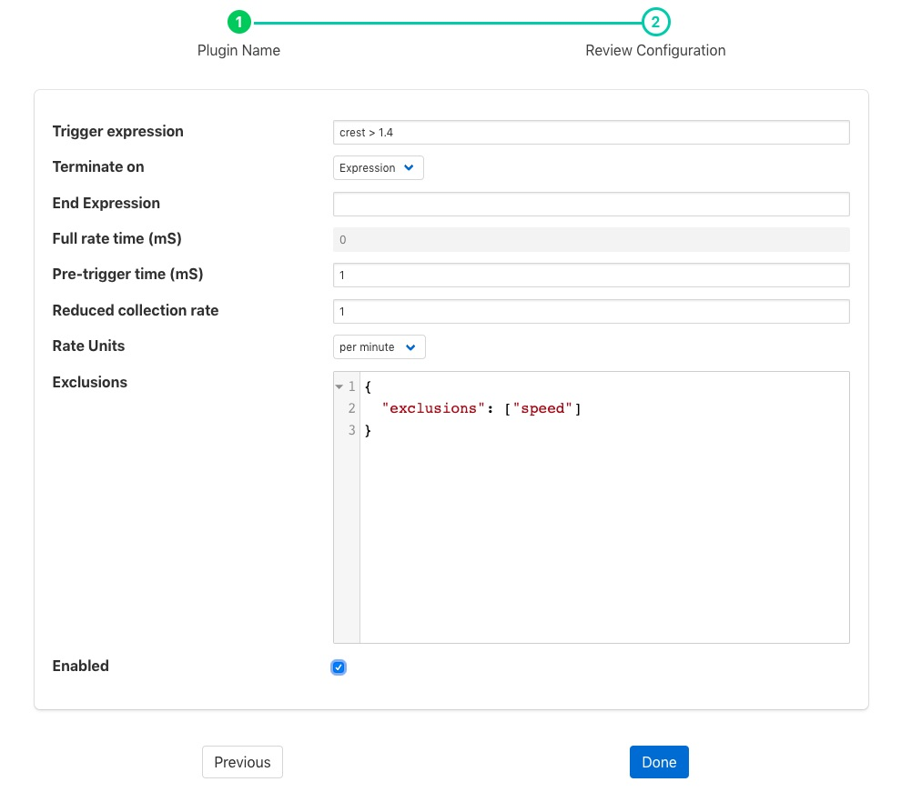
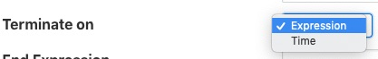
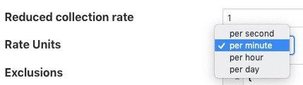

.. Images

.. Links
.. |exprtk| raw:: html

   <a href="http://www.partow.net/programming/exprtk/index.html">ExprTk</a>

.. |foglamp-south-expression| raw:: html

   <a href="../foglamp-south-expression/index.html">foglamp-south-expression</a>

.. |foglamp-filter-threshold| raw:: html

   <a href="../foglamp-filter-threshold/index.html">foglamp-filter-threshold</a>

.. |foglamp-filter-expression| raw:: html

   <a href="../foglamp-filter-expression/index.html">foglamp-filter-expression</a>

Rate Filter
===========

The *foglamp-filter-rate* plugin that can be used to reduce the rate a reading is stored
until an interesting event occurs. The filter will read data at full
rate from the input side and buffer data internally, sending out averages
for each value over a time frame determined by the filter configuration.

The user can provide either one or two simple expressions that will be evaluated to
form a trigger for the filter. One expressions will set the trigger and
the other will clear it. When the trigger is set then the filter will
no longer average the data over the configured time period, but will
instead send the full bandwidth data out of the filter. If the second expression, the
one that clears the full rate sending of data is omitted then the full rate is
cleared as soon as the trigger expression returns false. Alternatively the filter can be
configured to clear the sending of full rate data after a fixed time.

The filter also allows a pre-trigger time to be configured. In this
case it will buffer this much data internally and when the trigger is
initially set this pre-buffered data will be sent. The pre-buffered data
is discarded if the trigger is not set and the data gets to the defined
age for holding pre-trigger information.

Rate filters are added in the same way as any other filters.

  - Click on the Applications add icon for your service or task.

  - Select the *rate* plugin from the list of available plugins.

  - Name your rate filter.

  - Click *Next* and you will be presented with the following configuration page

    +----------+
    | |rate_1| |
    +----------+

  - Configure your rate filter 

    - **Trigger Expression**: An expression to set the trigger for full rate data

    - **Terminate ON**: The mechanism to stop full rate forwarding, this may be another expression or a time window

      +----------+
      | |rate_2| |
      +----------+

    - **End Expression**: An expression to clear the trigger for full rate data, if left blank this will simply be the trigger filter evaluating to false

    - **Full rate time (ms)**: The time window, in milliseconds to forward data at the full rate

    - **Pre-trigger time (ms)**: An optional pre-trigger time expressed in milliseconds

    - **Reduced collection rate**: The nominal data rate to send data out. This defines the period over which is outgoing data item is averaged.

    - **Rate Units**: The units that the reduced collection rate is expressed in; per second, minute, hour or day

      +----------+
      | |rate_3| |
      +----------+

    - **Exclusions**: A set of asset names that are excluded from the rate limit processing and always sent at full rate

  - Enable your filter and click *Done*

For example if the filter is working with a SensorTag and it reads the tag
data at 10ms intervals but we only wish to send 1 second averages under
normal circumstances. However if the X axis acceleration exceed 1.5g
then we want to send full bandwidth data until the X axis acceleration
drops to less than 0.2g, and we also want to see the data for the 1
second before the acceleration hit this peak the configuration might be:

  - **Nominal Data Rate**: 1, data rate unit "per second"

  - **Trigger set expression**: X > 1.5

  - **Trigger clear expression**: X < 0.2

  - **Pre-trigger time (mS)**: 1000

The trigger expression uses the same expression mechanism, |exprtk|  as the
|foglamp-south-expression|, |foglamp-filter-expression| and |foglamp-filter-threshold| plugins

Expression may contain any of the following...

  - Mathematical operators (+, -, \*, /, %, ^)

  - Functions (min, max, avg, sum, abs, ceil, floor, round, roundn, exp, log, log10, logn, pow, root, sqrt, clamp, inrange, swap)

  - Trigonometry (sin, cos, tan, acos, asin, atan, atan2, cosh, cot, csc, sec, sinh, tanh, d2r, r2d, d2g, g2d, hyp)

  - Equalities & Inequalities (=, ==, <>, !=, <, <=, >, >=)

  - Logical operators (and, nand, nor, not, or, xor, xnor, mand, mor)

.. note::

  This plugin is designed to work with streams with a single asset in the stream, there is no mechanism in the expression syntax to support multiple asset names.
