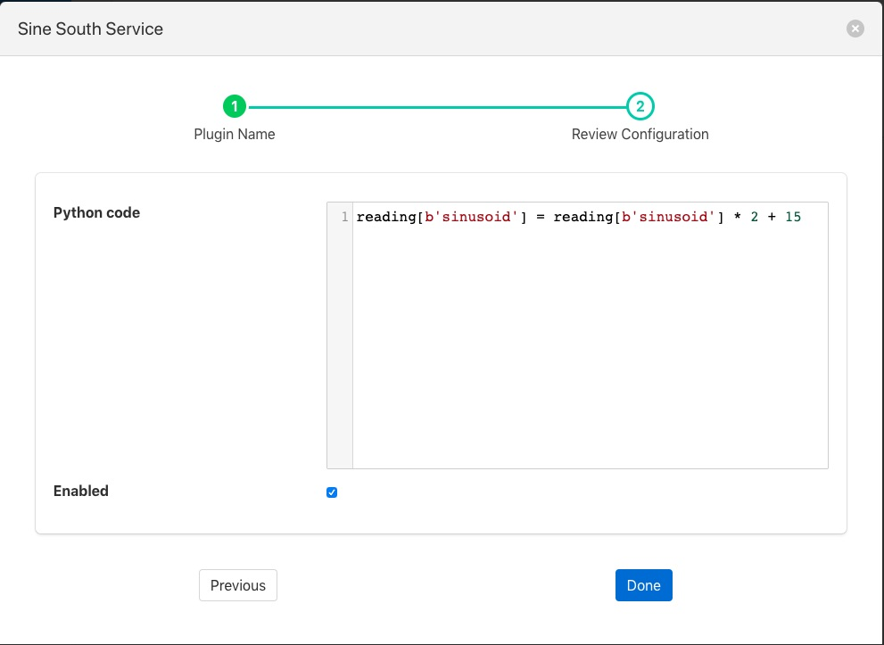

.. Images

Simple Python Filter
====================

The *foglamp-filter-simple-python* plugin allows very simple Python code to be used as a filter. A user may effectively write expressions in Python and have them execute in a filter.

The data is available within your Python code as a variable, named *reading* for each asset. You may access each data point within the asset by indexing the reading with the data point name. For example if your asset has two data points, *voltage* and *current*, then you would access these two values as

.. code-block:: python

   voltage = reading[b'voltage']
   current = reading[b'current']

Using this type of filter it is possible to modify values of data points within an asset, remove data points in an asset or add new data points to an asset. It is **not** possible to remove assets or add new assets. The filter uses a Python 3 run time environment, therefore Python 3 syntax should be used.

The following examples show how to filter the readings data,

- Change datapoint value

   .. code-block:: console

      reading[b'point_1'] = reading[b'point_1'] * 2 + 15

- Create a new datapoint while filtering

  .. code-block:: console

     reading[b'temp_fahr'] = reading[b'temperature'] * 9 / 5 + 32

- Generate an exponential moving average (ema)

   In this case we need to parse some data while filtering current data set the filter receives in input. A global 'user_data' empty dictionary is available to the Python interpreter and key values can be easily added. This illustrates the ability to maintain state within your filter.

   .. code-block:: console

      global user_data
      if not user_data:
          user_data['latest'] = None
      for attribute in list(reading):
          if not user_data['latest']:
              user_data['latest'] = reading[attribute]
          user_data['latest'] = reading[attribute] * 0.07 + user_data['latest'] * (1 - 0.07)
          reading[b'ema'] = user_data['latest']

Simple Python filters are added in the same way as any other filters.

  - Click on the Applications add icon for your service or task.

  - Select the *simple-python* plugin from the list of available plugins.

  - Name your python filter.

  - Click *Next* and you will be presented with the following configuration page

+------------+
| |python_1| |
+------------+

  - Configure your simple Python filter

    - **Python Code**: Enter the code required for your filter.

  - Enable your filter and click *Done*
