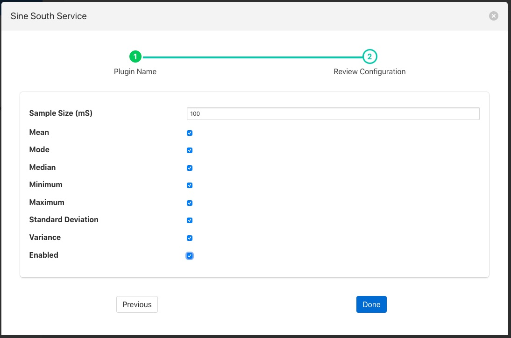

.. Images

Statistics Filter
=================

The *foglamp-filter-statistics* filter is designed to accept data from one or more asset and produces statistics over specified time intervals, for example produce the mean, standard deviation and variance for 100 milliseconds samples of the data. The statistics that can be produced are;

  - mean - the average of all the values in the time period calculated by adding up all the values and dividing by the number of values.

  - mode - the number that appears most often in the time period.

  - median - the median is found by sorting all the values in the time period and then choosing the middle number in this sorted set

  - minimum - the minimum value that appears within the time period

  - maximum - the maximum value that appears within the time period
  
  - standard deviation - the standard deviation measures the spread of the numbers above and below the mean value

  - variance - the variance is the average of the squared differences from the mean value calculated over the time period

Statistics filters are added in the same way as any other filters.

  - Click on the Applications add icon for your service or task.

  - Select the *statistics* plugin from the list of available plugins.

  - Name your statistics filter.

  - Click *Next* and you will be presented with the following configuration page

+----------------+
| |statistics_1| |
+----------------+

  - Configure your statistics filter 

    - **Mean**: A toggle that controls inclusion of the mean value

    - **Mode**: A toggle that controls inclusion of the mode value

    - **Median**: A toggle that controls inclusion of the median value

    - **Minimum**: A toggle that controls inclusion of the minimum value

    - **Maximum**: A toggle that controls inclusion of the maximum value

    - **Standard Deviation**: A toggle that controls inclusion of the standard deviation value

    - **Variance**: A toggle that controls inclusion of the variance value

  - Enable your filter and click *Done*

