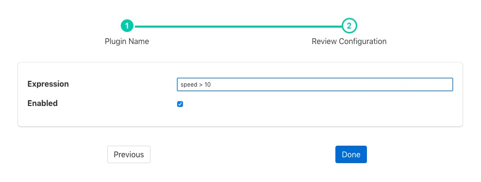

.. Images

.. Links
.. |exprtk| raw:: html

   <a href="http://www.partow.net/programming/exprtk/index.html">ExprTk</a>

Threshold Filter
================

The *foglamp-filter-threshold* plugin is a filter that is used to control the forwarding of data within FogLAMP. Its use is to only allow data to be stored or forwarded if a condition about that data is true. This can save storage or network bandwidth by eliminating data that is of no interest.

The filter uses an expression, that is entered by the user, to evaluate if data should be forwarded, if that expression evaluates to true then the data is forwarded, in the case of a south service this would be to the FogLAMP storage. In the case of a north task this would be to the upstream system.

.. note::
   If the threshold filter is part of a chain of filters and the data is not forwarded by the threshold filter, i.e. the expression evaluates to false, then the following filters will not receive the data.

If an asset in the case of a south service, or data stream in the case of a north task, has other data points or assets that are not part of the expression, then they too are subject to the threshold. If the expression evaluates to false then no assets will be forwarded on that stream. This allows a single value to control the forwarding of data.

Another example use might be to have two north streams, one that uses a high cost, link to send data when some condition that requires close monitoring occurs and the other that is used to send data by a lower cost mechanism when normal operating conditions apply.

E.g. We have a temperature critical process, when the temperature is above 80 degrees it most be closely monitored. We use a high cost link to send data north wards in this case. We would have a north task setup that has the threshold filter with the condition:

.. code-block:: console

  temperature >= 80

We then have a second, lower cost link with a north task using the threshold filter with the condition:

.. code-block:: console

  temperature < 80

This way all data is sent once, but data is sent in an expedited fashion if the temperature is above the 80 degree threshold.

Threshold filters are added in the same way as any other filters.

  - Click on the Applications add icon for your service or task.

  - Select the *threshold* plugin from the list of available plugins.

  - Name your threshold filter.

  - Click *Next* and you will be presented with the following configuration page

+-------------+
| |threshold| |
+-------------+

  - Enter the expression to control forwarding in the box labeled *Expression*

  - Enable the filter and click on *Done* to activate it

Expressions
-----------

The *foglamp-filter-threshold* plugin makes use of the |exprtk| library to do run time expression evaluation. This library provides a rich mathematical operator set, the most useful of these in the context of this plugin are;

  - Comparison operators (=, ==, <>, !=, <, <=, >, >=)

  - Logical operators (and, nand, nor, not, or, xor, xnor, mand, mor)

  - Mathematical operators (+, -, \*, /, %, ^)

  - Functions (min, max, avg, sum, abs, ceil, floor, round, roundn, exp, log, log10, logn, pow, root, sqrt, clamp, inrange, swap)

  - Trigonometry (sin, cos, tan, acos, asin, atan, atan2, cosh, cot, csc, sec, sinh, tanh, d2r, r2d, d2g, g2d, hyp)

Within the expression the data points of the asset become symbols that may be used; therefore if an asset contains values "voltage" and "current" the expression will contain those as symbols and an expression of the form

.. code-block:: console

   voltage * current > 1000

can be used to determine if power (voltage * current) is greater than 1kW.
