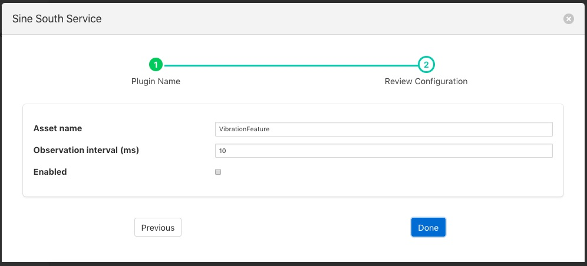

.. Images

Vibration Features Filter
=========================

The *foglamp-filter-vibration_features* filter collects readings for configured observation interval, then calculates statistics on these readings
and puts these statistics into a new reading.

  - mean - the average of all the values in the time period calculated by adding up all the values and dividing by the number of values.

  - median - the median is found by sorting all the values in the time period and then choosing the middle number in this sorted set

  - standard deviation - the standard deviation measures the spread of the numbers above and below the mean value

  - variance - the variance is the average of the squared differences from the mean value calculated over the time period

  - RMS - the root mean squared of the waveform

  - kurtosis - is a measure of the combined sizes of the two tails. It measures the amount of probability in the tails.

Vibration feature filters are added in the same way as any other filters.

  - Click on the Applications add icon for your service or task.

  - Select the *vibration_features* plugin from the list of available plugins.

  - Name your vibration feature filter.

  - Click *Next* and you will be presented with the following configuration page

+---------------+
| |vibration_1| |
+---------------+

  - Configure your vibration filter 

    - **Asset name**: The name of the asset to create. This is the asset that will hold the vibration feature data.

    - **Observation interval (ms)**: The interval over which the statistics are compiled.

  - Enable your filter and click *Done*

