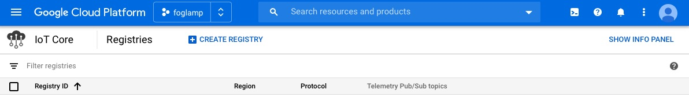
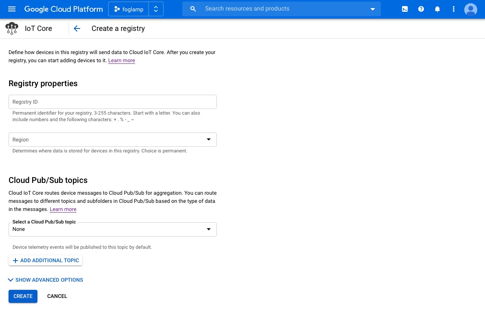
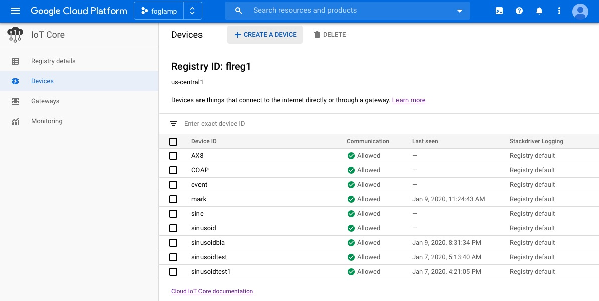
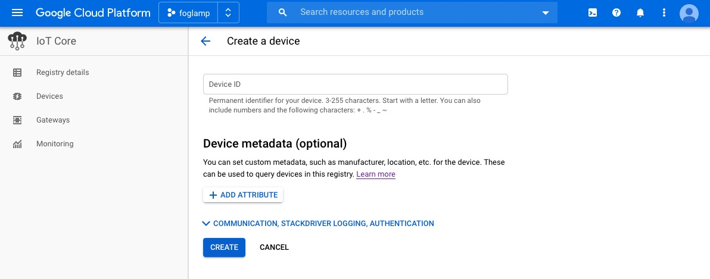
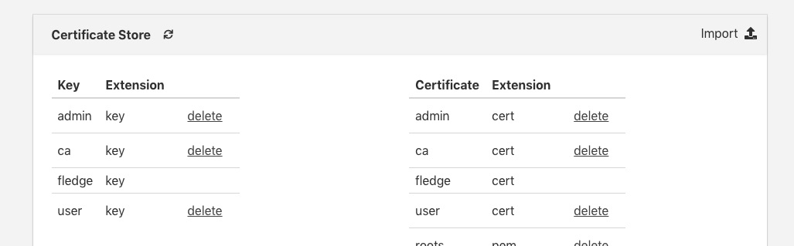
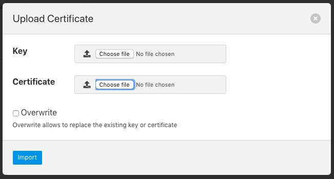
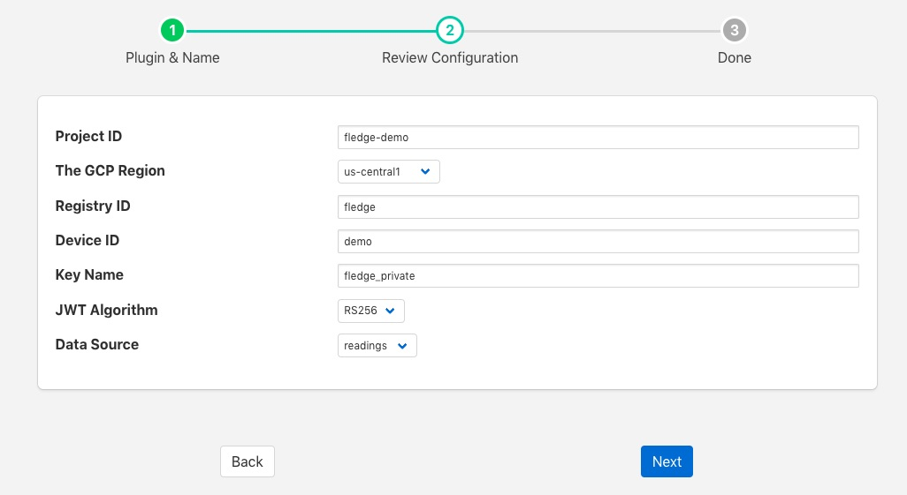
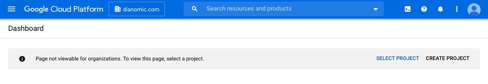
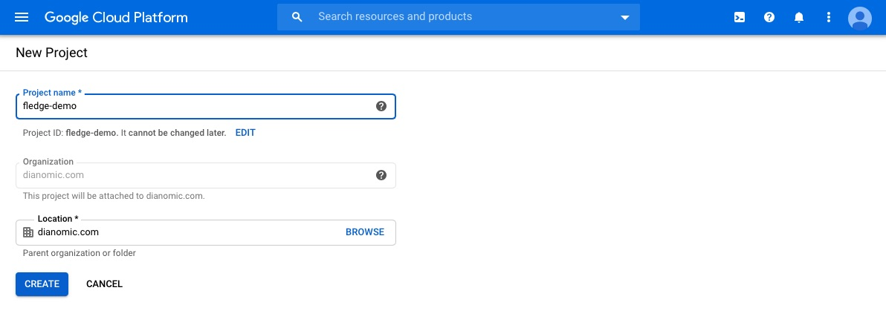

.. Images

.. Links
.. |tutorial| raw:: html

   <a href="https://cloud.google.com/community/tutorials/cloud-iot-FogLAMP">Using FogLAMP with IoT Core on Google Cloud</a>

.. |gcp_console| raw:: html

   <a href="https://console.cloud.google.com/iot">IoT Core page in the Cloud Console</a>

Google Cloud Platform North Plugin
==================================

The *foglamp-north-gcp* plugin provide connectivity from a FogLAMP system to the Google Cloud Platform. The plugin connects to the IoT Core in Google Cloud using MQTT and is fully compliant with the security features of the Google Cloud Platform. See |tutorial| for a tutorial on setting up a FogLAMP system and getting it to send data to Google Cloud.

Prerequisites
-------------

A number of things must be done in the Google Cloud before you can create your north connection to GCP. You must

  - Create a GCP IoT Core project

  - Download the roots.pem certificate from your GCP account

  - Create a registry

  - Create a device ID and configure a key pair for that device

  - Upload the certificates to the FogLAMP certificate store

Create GCP IoT Core Project
~~~~~~~~~~~~~~~~~~~~~~~~~~~

To create a new project

  - Goto the |gcp_console|

  - Select the Projects page and select the *Create New Project* option

    +----------+
    | |gcp_02| |
    +----------+

  - Enter your project details

    +----------+
    | |gcp_03| |
    +----------+

Download roots.pem
~~~~~~~~~~~~~~~~~~

To download the roots.pem security certificate

  - From the command line shell of your machine run the command

    .. code-block:: console

       $ wget https://pki.goog/roots.pem

Create a Registry
~~~~~~~~~~~~~~~~~

To create a registry in your project

  - Goto the |gcp_console|

  - Click on the menu icon in the top left corner of the page |gcp_menu|

  - Select the *Create Registry* option

    +----------------+
    | |gcp_registry| |
    +----------------+

  - A new screen is shown that allows you to create a new registry

    +--------------------+
    | |gcp_add_registry| |
    +--------------------+

  - Note the Registry ID and region as you will need these later

  - Select an existing telemetry topic or create a new topic (for example, projects/[YOUR_PROJECT_ID]/topics/[REGISTRY_ID])

  - Click on *Create*

Create a Device ID
~~~~~~~~~~~~~~~~~~

To create a device in your Google Cloud Project

  - Create an RSA public/private key pair on your local machine

    .. code-block:: console

       openssl genpkey -algorithm RSA -out rsa_FogLAMP.pem -pkeyopt rsa_keygen_bits:2048
       openssl rsa -in rsa_FogLAMP.pem -pubout -out rsa_FogLAMP.pem

  - Goto the |gcp_console|

  - In the left pane of the IoT Core page in the Cloud Console, click Devices

    +---------------+
    | |gcp_devices| |
    +---------------+

  - At the top of the Devices page, click *Create a device*

    +---------------------+
    | |gcp_create_device| |
    +---------------------+

  - Enter a device ID, you will need to add this in the north plugin configuration later

  - Click on the *ADD ATTRIBUTE COMMUNICATION, STACKDRIVER LOGGING, AUTHENTICATION* link to open the remainder of the inputs

  - Make sure the public key format matches the type of key that you created in the first step of this section (for example, RS256)

  - Paste the contents of your public key in the Public key value field.

Upload Your Certificates
~~~~~~~~~~~~~~~~~~~~~~~~

You should upload your certificates to FogLAMP

  - From the FogLAMP user interface select the *Certificate Store* from the left-hand menu bar

    +---------+
    | |certs| |
    +---------+

  - Click on the Import option in the top left corner

    +----------+
    | |import| |
    +----------+

  - In the Certificate option select the *Choose file* option and select your roots.pem and click on open

  - Repeat the above for your device key and certificate

Create Your North Task
~~~~~~~~~~~~~~~~~~~~~~

Having completed the pre-requisite steps it is now possible to create the north task to send data to GCP.

  - Select the *North* option from the left-hand menu bar.

  - Select GCP from the North Plugin list

  - Name your North task and click on *Next*

    +----------+
    | |gcp_01| |
    +----------+

  - Configure your GCP plugin

    - **Project ID**: Enter the project ID you created in GCP

    - **The GCP Region**: Select the region in which you created your registry

    - **Registry ID**: The Registry ID you created should be entered here

    - **Device ID**: The Device ID you created should be entered here

    - **Key Name**: Enter the name of the device key you uploaded to the certificate store

    - **JWT Algorithm**: Select the algorithm that matches the key you created earlier

    - **Data Source**: Select the data to send to GCP, this may be readings or FogLAMP statistics

  - Click on *Next*

  - Enable your plugin and click on *Done*
