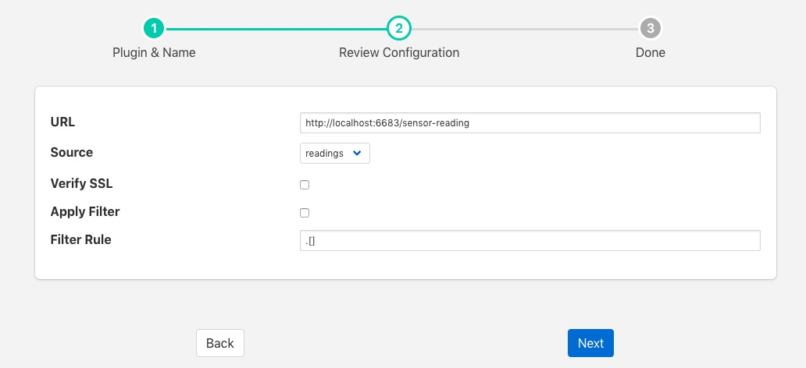

.. Images

.. Links
.. |http-c| raw:: html

   <a href="../foglamp-north-http-c/index.html">C++ version</a>

.. |http-south| raw:: html

   <a href="../foglamp-south-http/index.html">South service</a>

North HTTP
==========

The *foglamp-north-http* plugin allows data to be sent from the north of one FogLAMP instance into the south of another FogLAMP instance. It allows hierarchies of FogLAMP instances to be built. The FogLAMP to which the data is sent must run the corresponding |http-south| in order for data to flow between the two FogLAMP instances. The plugin supports both HTTP and HTTPS transport protocols and sends a JSON payload of reading data in the internal FogLAMP format.

Filters may be applied to the connection in either the north task that loads this plugin or the receiving south service on the up stream FogLAMP.

A |http-c| of this plugin exists also that performs the same function as this plugin, the pair are provided for purposes of comparison and the user may choose whichever they prefer to use.

To create a north task to send to another FogLAMP you should first create the |http-south| that will receive the data. Then create a new north tasks by;

  - Selecting *North* from the left hand menu bar.

  - Click on the + icon in the top left

  - Choose http_north from the plugin selection list

  - Name your task

  - Click on *Next*

  - Configure the plugin

    +----------+
    | |http_1| |
    +----------+

    - **URL**: The URL of the receiving |http-south|, the address and port should match the service in the up stream FogLAMP. The URL can specify either HTTP or HTTPS protocols.

    - **Source**: The data to send, this may be either the reading data or the statistics data

    - **Verify SSL**: When HTTPS rather the HTTP is used this toggle allows for the verification of the certificate that is used. If a self signed certificate is used then this should not be enabled.

    - **Apply Filter**: This allows a simple jq format filter rule to be applied to the connection. This should not be confused with FogLAMP filters and exists for backward compatibility reason only.

    - **Filter Rule**: A jq filter rule to apply. Since the introduction of FogLAMP filters in the north task this has become deprecated and should not be used.

  - Click *Next*

  - Enable your task and click *Done*
