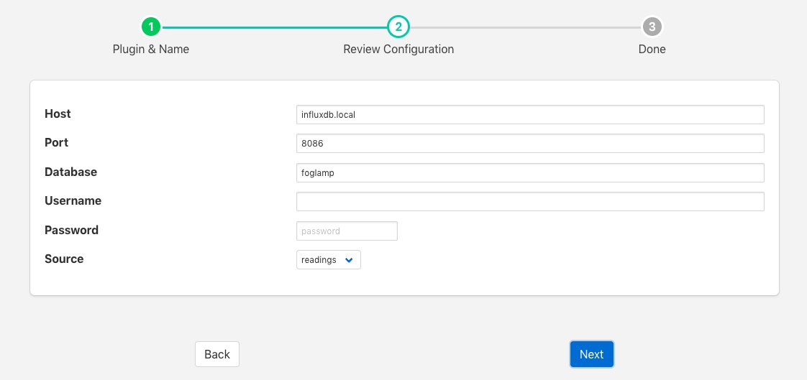

.. Images

.. Links
.. |influxdb| raw:: html

   <a href="https://www.influxdata.com">InfluxDB</a>

InfluxDB Time Series Database
=============================

The *foglamp-north-influxdb* plugin is designed to send data from FogLAMP to the |influxdb| open source time series database.

The process of creating a North InfluxDB is similar to any other north setup

  - Selecting the *North* option in the left-hand menu bar

  - Click on the add icon in the top right corner. 
    
  - In the *North Plugin* list select the influxdb option.

  - Click *Next*

  - Configure your InfluxDB plugin

    +--------------+
    | |influxdb_1| |
    +--------------+

    - **Host**: The hostname or IP address of the machine where your InfluxDB server is running.

    - **Port**: The port on which your InfluxDB server is listening.

    - **Database**: The database in your InfluxDB server int which to write data.

    - **Username**: The username if any to use to authenticate with your InfluxDB server.

    - **Password**: The password to use to authenticate with your InfluxDB server.

    - **Source**: The source of data to send, this may be either FogLAMP readings or the FogLAMP statistics

  - Click *Next*

  - Enable your north task and click on *Done*
