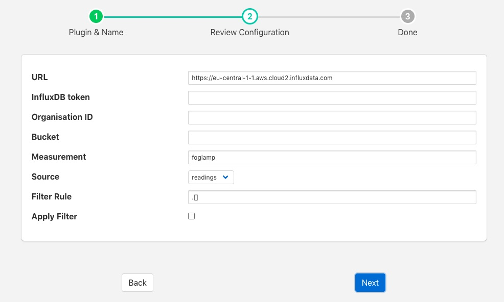

.. Images

.. Links
.. |influx| raw:: html

   <a href="https://www.influxdata.com">InfluxDB Cloud</a>

InfluxDB Cloud
==============

The *foglamp-north-influxdbcloud* plugin is designed to send data from FogLAMP to the |influx| system for collection and analysis of data.

The process of creating a North InfluxDB Cloud connection is similar to any other north setup

  - Selecting the *North* option in the left-hand menu bar

  - Click on the add icon in the top right corner. 
    
  - In the *North Plugin* list select the *influxdbcloud* option.

  - Click *Next*

  - Configure your InfluxDB Cloud plugin

    +--------------+
    | |influxdb_1| |
    +--------------+

    - **URL**: The URL of the InfluxDB instance you are using

    - **InfluxDB token**: an authorization token that has been generated by the InfluxDB Cloud

    - **Organisation ID**: Your organization ID from the InfluxDB Cloud. You can find this by looking at the URL you use after connecting the InfluxDB Cloud.

    - **Bucket**: The bucket in InfluxDB CLoud where you wish to store your data.

    - **Measurement**: The measurement to use for the data you send to InfluxDB Cloud

    - **Source**: The source of data to send, this may be either FogLAMP readings or the FogLAMP statistics

    - - **Apply Filter**: This allows a simple jq format filter rule to be applied to the connection. This should not be confused with FogLAMP filters and exists for backward compatibility reasons only.

    - **Filter Rule**: A jq filter rule to apply. Since the introduction of FogLAMP filters in the north task this has become deprecated and should not be used.

  - Click *Next*

  - Enable your north task and click on *Done*
