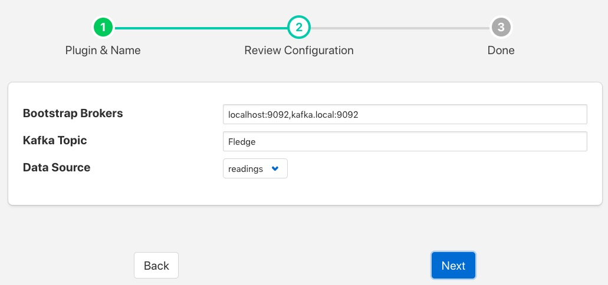

.. Images

Kafka Producer
==============

The *foglamp-north-kafka* plugin sends data from FogLAMP to the an Apache Kafka. FogLAMP acts as a Kafka producer, sending reading data to Kafka. This implementation is a simplified producer that sends all data on a single Kafka topic. Each message contains an asset name, timestamp and set of readings values as a JSON document.

The configuration of the *Kafka* plugin is very simple, consisting of three parameters that must be set.

+---------+
| |kafka| |
+---------+

  - **Bootstrap Brokers**: A comma separate list of Kafka brokers to use to establish a connection to the Kafka system.
  - **Kafka Topic**: The Kafka topic to which all data is sent.
  - **Data Source**: Which FogLAMP data to send to Kafka; Readings or FogLAMP Statistics.
