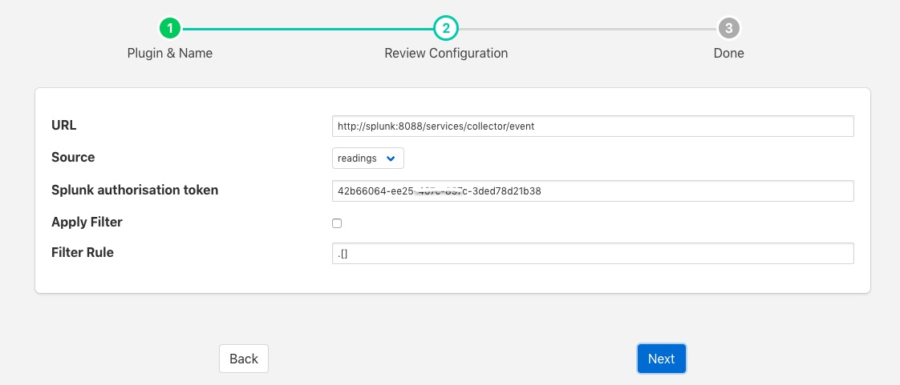

.. Images

.. Links
.. |splunk| raw:: html

   <a href="https://www.splunk.com">Splunk</a>

Splunk Data Collector
=====================

The *foglamp-north-splunk* plugin is designed to send data from FogLAMP to the |splunk| system for collecting and analysis of data.

The process of creating a North Splunk is similar to any other north setup

  - Selecting the *North* option in the left-hand menu bar

  - Click on the add icon in the top right corner. 
    
  - In the *North Plugin* list select the splunk option.

  - Click *Next*

  - Configure your Splunk plugin

    +------------+
    | |splunk_1| |
    +------------+

    - **URL**: The URL of the splunk collector for events 

    - **Source**: The source of data to send, this may be either FogLAMP readings or the FogLAMP statistics

    - **Splunk authorisation token**: an authorisation token that has been issued by the splunk data collector

    - - **Apply Filter**: This allows a simple jq format filter rule to be applied to the connection. This should not be confused with FogLAMP filters and exists for backward compatibility reasons only.

    - **Filter Rule**: A jq filter rule to apply. Since the introduction of FogLAMP filters in the north task this has become deprecated and should not be used.

  - Click *Next*

  - Enable your north task and click on *Done*
