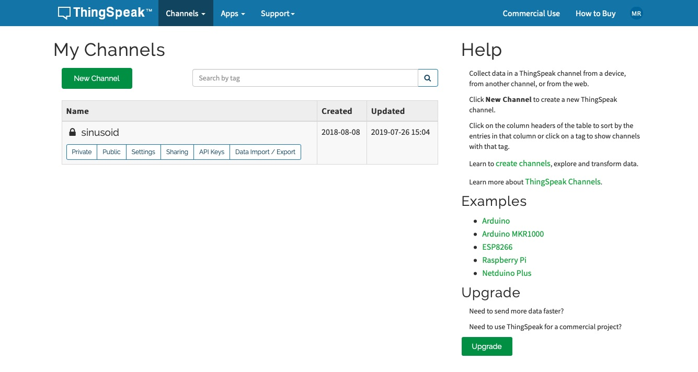
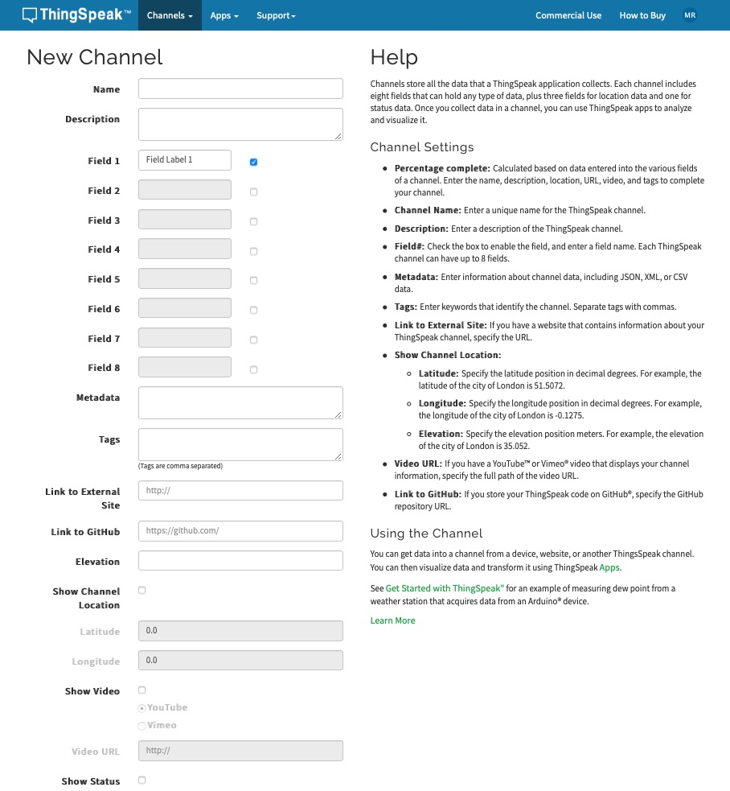
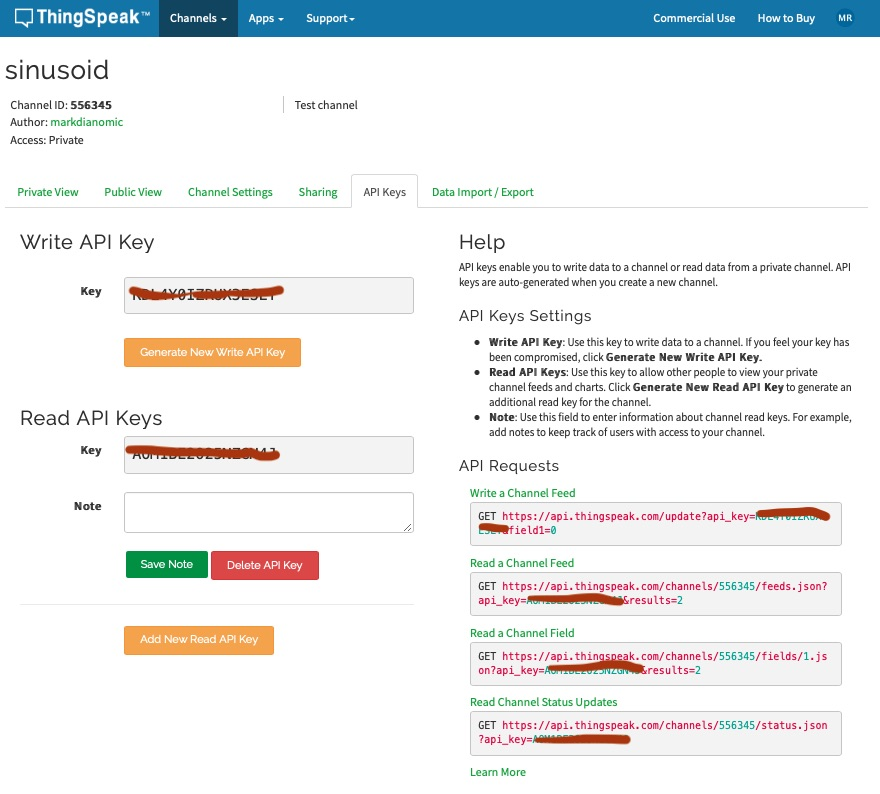
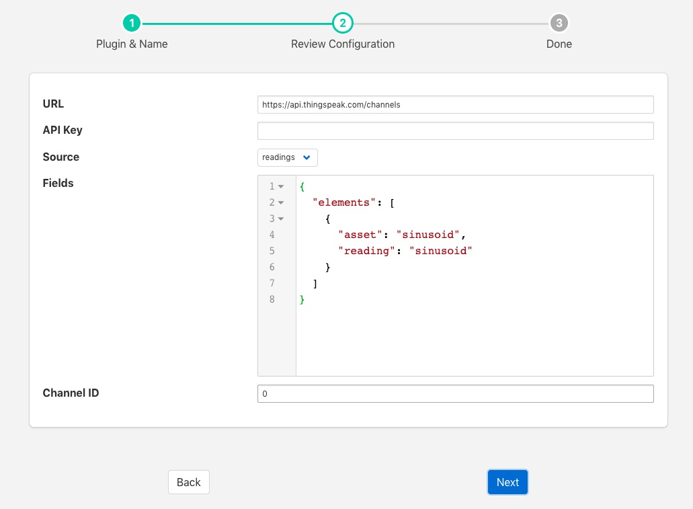

.. Images

.. Links
.. |ThingSpeak| raw:: html

   <a href="https://thingspeak.com">ThingSpeak</a>

.. |ThingSpeakLogin| raw:: html

   <a href="https://thingspeak.com/login">ThingSpeak</a>

ThingSpeak
==========

The *foglamp-north-thingspeak* plugin provides a mechanism to |ThingSpeak|, allowing an easy route to send data from an FogLAMP environment into MATLAB.

In order to send data to ThingSpeak you must first create a channel to receive it.

  - Login to your |ThingSpeakLogin| account

  - From the menu bar select the *Channels* menu and the *My Channels* option

    +----------------+
    | |thingspeak_1| |
    +----------------+

  - Click on *New Channel* to create a new channel

    +----------------+
    | |thingspeak_2| |
    +----------------+

  - Enter the details for your channel, in particular name and the set of fields. These field names should match the asset names you are going to send from FogLAMP.

  - When satisfied click on *Save Channel*

  - You will need the channel ID and the API key for your channel. To get this for a channel, on the *My Channels* page click on the *API Keys* box for your channel

    +----------------+
    | |thingspeak_3| |
    +----------------+

Once you have created your channel on |ThingSpeak| you may create your north task on FogLAMP to send data to this channel

  - Select *North* from the left hand menu bar.

  - Click on the + icon in the top left

  - Choose ThingSpeak from the plugin selection list

  - Name your task

  - Click on *Next*

  - Configure the plugin

    +----------------+
    | |thingspeak_4| |
    +----------------+

    - **URL**: The URL of the ThingSpeak server, this can usually be left as the default.

    - **API Key**: The write API key from the ThingSpeak channel you created

    - **Source**: Controls if readings data or FogLAMP statistics are to be send to ThingSpeak

    - **Fields**: Allows you to select what fields to send to ThingSpeak. It’s a JSON document that contains a single array called elements. Each item of the array is a JSON object that has two properties, asset and reading. The asset should match the asset you wish to send and the reading the data point name.

    - **Channel ID**: The channel ID of your ThingSpeak Channel

  - Click on *Next*

  - Enable your north task and click on *Done*
