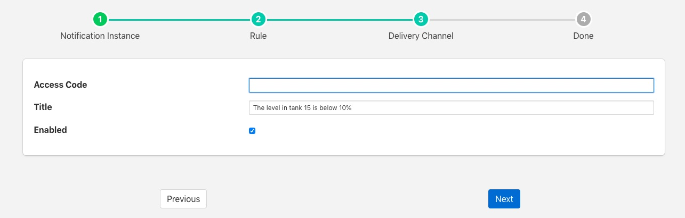

.. Images

Amazon Alexa Notification
=========================

The *foglamp-notify-alexa* notification delivery plugin sends notifications via Amazon Alexa devices using the Alexa *NotifyMe* skill.

When you receive a notification Alexa will make a noise to say you have a new notification
and the green light on your Alexa  device will light to say you have waiting notifications.
To hear your notifications simply say "Alexa, read my notifications"

To enable notifications on an Alexa device

  - You must enable the NotifyMe skill on your Amazon Alexa device.

  - Link this skill to your Amazon account 
    
  - NotifyMe will send you an access code that is required to configure this plugin.

Once you have created your notification rule and move on to the delivery mechanism

  - Select the alexa plugin from the list of plugins

  - Click *Next*

    +-----------+
    | |alexa_1| |
    +-----------+

  - Configure the plugin

    - **Access Code**: Paste the access code you received from the *NotifyMe* application here

    - **Title**: This is the title that the Alexa device will read to you

  - Enable the plugin and click *Next*

  - Complete your notification setup

When you notification triggers the Alexa device will read the title text to you followed by either "Notification has triggered" or "Notification has cleared".
