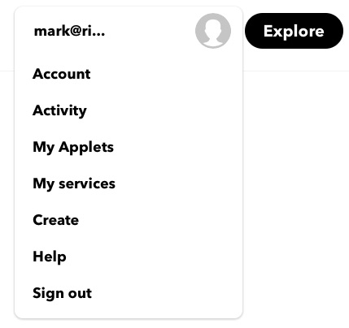
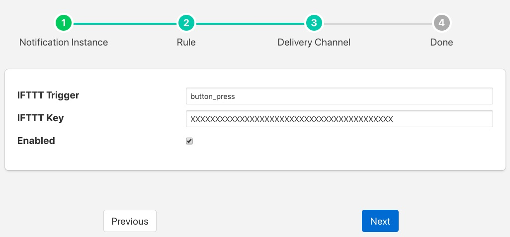

.. Images

IFTTT Delivery Plugin
=====================

The *foglamp-notify-ifttt* is a notification delivery plugin designed to trigger an action on the *If This Than That* IoT platform. IFTTT allows the user to setup a webhook that can be used to trigger processing on the platform. The webhook could be sending an IFTTT notification to a destination not support by any FogLAMP plugin to controlling a device that is controllable via IFTTT.

In order to use the IFTTT webhook you must obtain a key from IFTTT by visiting your IFTTT account

  - Select the "My Applets" page from your account pull down menu

+-----------+
| |ifttt_1| |
+-----------+

  - Select "New Applet"

  - Click on the blue "+ this" logo

  - Choose the service Webhooks

  - Click on the blue box "Receive a web request"

  - Enter an "Event Name", this may be of your choosing and will be put in the configuration entry 'Trigger' for the FogLAMP plugin

  - Click on the "+ that" logo

  - Select the action you wish to invoke

Once you have setup your webhook on IFTTT you can now proceed to setup the FogLAMP delivery notification plugin. Create you notification, choose and configure your notification rule. Select the IFTTT delivery plugin and click on *Next*. You will be presented with the IFTTT plugin configuration page.

+-----------+
| |ifttt_2| |
+-----------+

There are two important items to be configured

  - **IFTTT Trigger**: This is the *Maker Event* that you used in IFTTT when defining the action that the webhook should trigger.
  - **IFTTT Key**: This is the webhook key you obtain from the IFTTT platform.

Enable the delivery and click on *Next* to move to the final stage of completing your notification.
