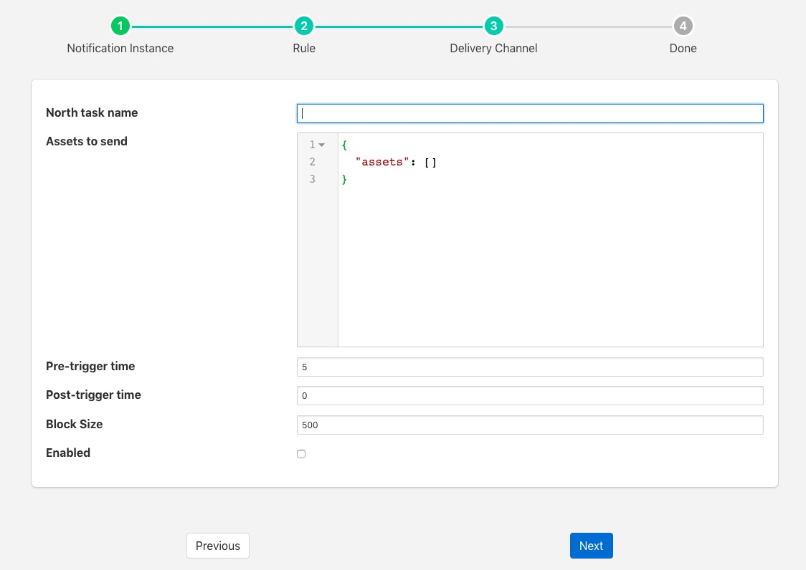

.. Images

Conditional Forwarding
======================

The *foglamp-notify-north* plugin is designed to allow conditional forwarding of data to an existing north application from within FogLAMP.

The scenario the plugin addresses is the need to send data to a system north of FogLAMP when a condition occurs. The sending is done via a standard FogLAMP north task and can use any plugin such as OMF, GCP, InfluxDB, etc. The condition used to send this data is monitored using the notification server, when the rule in the notification triggers we send data from the FogLAMP storage service to the specified north task.

The data that is send is based on the time the notification triggered and two configuration parameters, pre-trigger and post-trigger times. The pre-trigger setting control how long before the event the data is sent and the post-trigger for how long after the event data is sent. 

The data that is sent may be anything that is buffered in the Foglamp storage service. A list of assets to send may be configured as part of the plugin configuration.

Once you have created your notification rule and move on to the delivery mechanism

  - Select the North plugin from the list of plugins

  - Click *Next*

  +-----------+
  | |north_1| |
  +-----------+

  - Configure the delivery plugin

    - **North task name**: This is the name of a north task to use for the sending of the data. The north task should have already been created but should be disabled.

    - **Assets to send**: A JSON structure that contains the list of assets that should be sent via the north task. This list is a simple JSON array of asset names.

    - **Pre-trigger time**: The length of time in seconds before the notification triggers for which data should be sent.

    - **Post-trigger time**: The length of time in seconds after the notification triggers for which data should be sent.

    - **Block size**: The size of the data block sent to the north service, this is a tuning parameter to throttle the data sent, under most circumstances it may be left as the default.

  - Enable the plugin and click *Next*

  - Complete your notification setup
