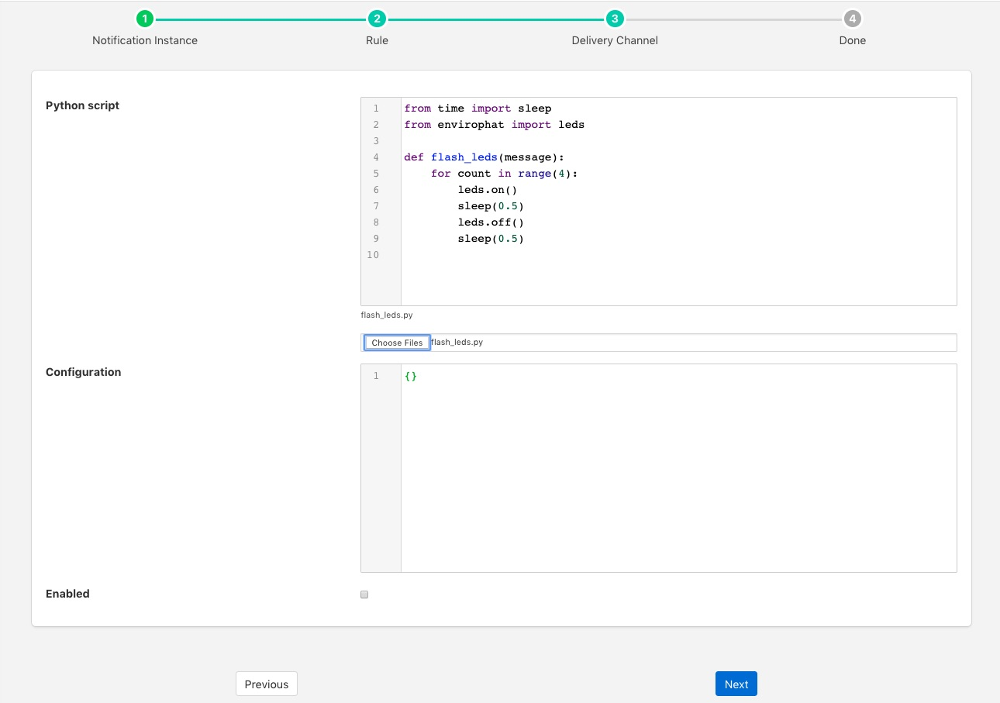

.. Images

Python 3.5 Script
=================

The *foglamp-notify-python35* notification delivery plugin allows a user supplied Python script to be executed when a notification is triggered or cleared. The script should be written in Python 3.5 syntax.

A Python script should be provided in the form of a function, the name of that function should match the name of the file the code is loaded form. E.g if you have a script to run which you have saved in a file called alert_light.py it should contain a function alert_light. ~that function is called with a message which is defined in notification itself as a simple string.

A second function may be provided by the Python plugin code to accept configuration from the plugin that can be used to modify the behavior of the Python code without the need to change the code. The configuration is a JSON document which is again passed as a Python Dict to the set_filter_config function in the user provided Python code. This function should be of the form

.. code-block:: python

  def set_filter_config(configuration):
      config = json.loads(configuration['config'])
      value = config['key']
      ...
      return True

Once you have created your notification rule and move on to the delivery mechanism

  - Select the python35 plugin from the list of plugins

  - Click *Next*

    +------------+
    | |python_1| |
    +------------+

  - Configure the plugin

    - **Python Script**: This is the script that will be executed. Initially you are unable to type in this area and must load your initial script from a file using the *Choose Files* button below the text area. Once a file has been chosen and loaded you are able to update the Python code in this page.

    .. note::

         Any changes made to the script in this screen will be written back to the original file it was loaded from.

    - **Configuration**: You may enter a JSON document here that will be passed to the *set_filter_config* function of your Python code.

  - Enable the plugin and click *Next*

  - Complete your notification setup

Example Script
--------------

The following is an example script that flashes the LEDs on the Enviro pHAT board on a Raspberry Pi

.. code-block:: python

  from time import sleep
  from envirophat import leds
  def flash_leds(message):
      for count in range(4):
          leds.on()
          sleep(0.5)
          leds.off()
          sleep(0.5)

This code imports some Python libraries and then in a loop will turn the leds on and then off 4 times.

.. note::

   This example will take 4 seconds to execute, unless multiple threads have been turned on for notification delivery this will block any other notifications from being delivered during that time.

