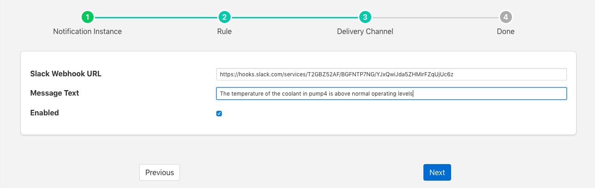
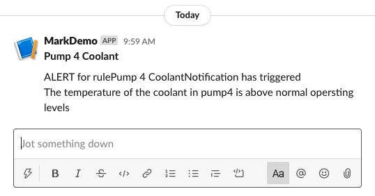
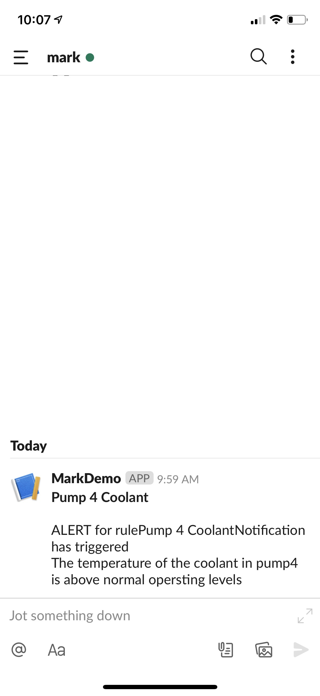

.. Images

.. Links
.. |api| raw:: html

   <a href="https://api.slack.com/apps" target="_blank">Slack API</a>

Slack Messages
==============

The *foglamp-notify-slack* delivery notification plugin allows notifications to be delivered as instant messages on the Slack messaging platform. The plugin uses a Slack webhook to post the message.

To obtain a webhook URL from Slack 

  - Visit the |api| page 

  - Select *Create New App*

  - Enter a name for your application, this must be unique for each FogLAMP slack application you create

  - Select your Slack workspace in which to deliver your notification. If not already logged in you may need to login to your workspace

  - Click on Create

  - Select *Incoming Webhooks*

  - Activate your webhook

  - Add your webhook to the workspace

  - Select the channel or individual to send the notification to

  - Authorize your webhook

  - Copy the Webhook URL which you will need when configuring the plugin

Once you have created your notification rule and move on to the delivery mechanism 

  - Select the slack plugin from the list of plugins

  - Click *Next*

  +-----------+
  | |slack_1| |
  +-----------+

  - Configure the delivery plugin

    - **Slack Webhook URL**: Paste the URL you obtain above from the |api| page

    - **Message Test**: Static text that will appear in the slack message you receive when the rule triggers

  - Enable the plugin and click *Next*

  - Complete your notification setup

When the notification rule triggers you will receive messages in you Slack client on your desk top

+-----------+
| |slack_2| |
+-----------+

and/or your mobile devices

+-----------+
| |slack_3| |
+-----------+

