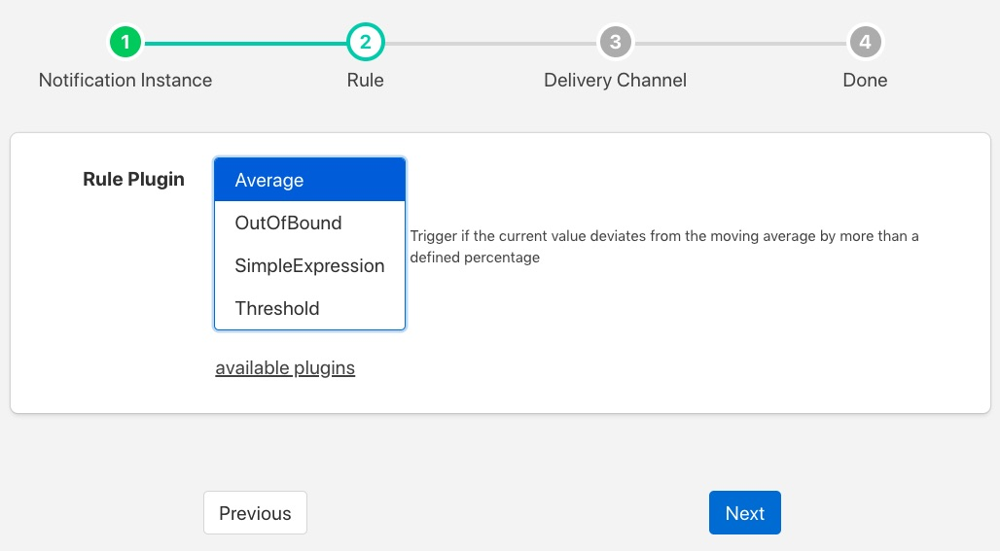
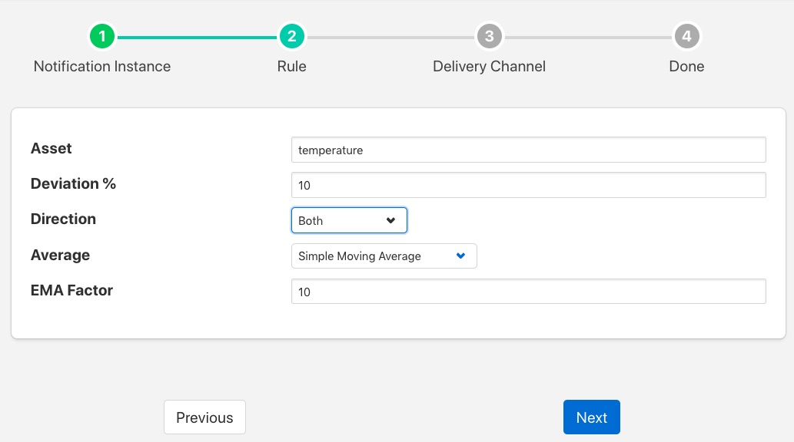
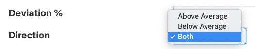
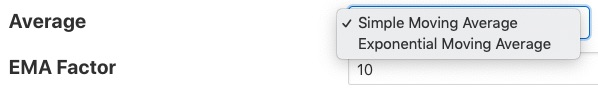

.. Images

Moving Average Rule
===================

The *foglamp-rule-average* plugin is a notifcation rule that is used to detect when a value moves outside of the determined average by more than a specified percentage. The plugin only monitors a single asset, but will monitor all data points within that asset. It will trigger if any of the data points within the asset differ by more than the configured percentage, an average is maintained for each data point separately.

During the configuration of a notification use the screen presented to choose the average plugin as the rule.

+-------------+
| |average_1| |
+-------------+

The next screen you are presented with provides the configuration options for the rule.

+-------------+
| |average_2| |
+-------------+

The *Asset* entry field is used to define the single asset that the plugin should monitor.

The *Deviation %* defines how far away from the observed average the current value should be in order to considered as triggering the rule.

+-------------+
| |average_3| |
+-------------+

The *Direction* entry is used to define if the rule should trigger when the current value is above average, below average or in both cases.

+-------------+
| |average_4| |
+-------------+

The *Average* entry is used to determine what type of average is used for the calculation. The average calculated may be either a simple moving average or an exponential moving average. If an exponential moving average is chosen then a second configuration parameter, *EMA Factor*, allows the setting of the factor used to calculate that average.

Exponential moving averages give more weight to the recent values compared to historical values. The smaller the EMA factor the more weight recent values carry. A value of 1 for *EMA Factor* will only consider the most recent value.

.. note::

   The Average rule is not applicable to all data, only simple numeric values are considered and those values should not deviate with an average of 0 or close to 0 if good results are required. Data points that deviate wildly are also not suitable for this plugin.

