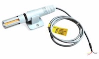
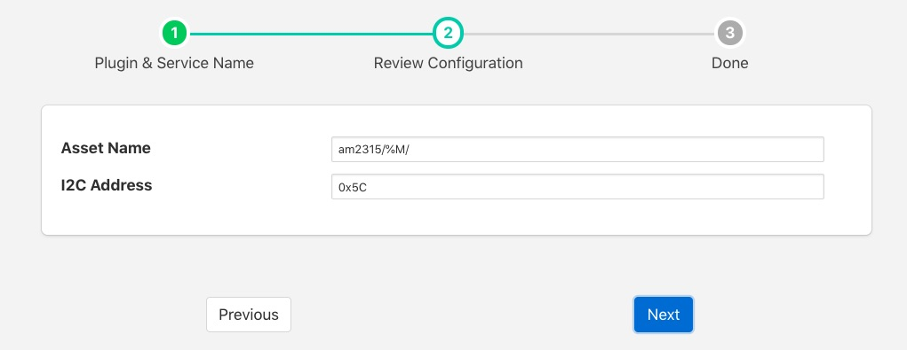

.. Images

.. |degC| replace:: :sup:`o`\ C

AM2315 Temperature & Humidity Sensor
====================================

The *foglamp-south-am2315* is a south plugin for a temperature and humidity sensor. The sensor connects via the I2C bus and can provide temperature data in the range -40\ |degC| to +125\ |degC| with an accuracy of 0.1\ |degC|.

The plugin will produce a single asset that has two data points; temperature and humidity.

.. note::

   The AM2315 is only available on the Raspberry Pi as it requires an I2C bus connection

To create a south service with the AM2315 plugin

  - Click on *South* in the left hand menu bar

  - Select *am2315* from the plugin list

  - Name your service and click *Next*

  +------------+
  | |am2315_2| |
  +------------+

  - Configure the plugin

    - **Asset Name**: The name of the asset that will be created. To help when multiple AM2315 sensors are used a %M may be added to the asset name. This will be replaced with the I2C address of the sensor.

    - **I2C Address**: The I2C address of the sensor, this allows multiple sensors to be added to the same I2C bus.

  - Click *Next*

  - Enable the service and click on *Done*

Wiring The Sensor
-----------------

The following table details the four connections that must be made from the sensor to the Raspberry Pi GPIO connector.

+--------+------+-------------+-------------------+
| Colour | Name | GPIO Pin    | Description       |
+========+======+=============+===================+
| Red    | VDD  | Pin 2 (5V)  | Power (3.3V - 5V) |
+--------+------+-------------+-------------------+
| Yellow | SDA  | Pin 3 (SDA) | Serial Data       |
+--------+------+-------------+-------------------+
| Black  | GND  | Pin 6 (GND) | Ground            |
+--------+------+-------------+-------------------+
| White  | SCL  | Pin 5 (SCL) | Serial Clock      |
+--------+------+-------------+-------------------+
