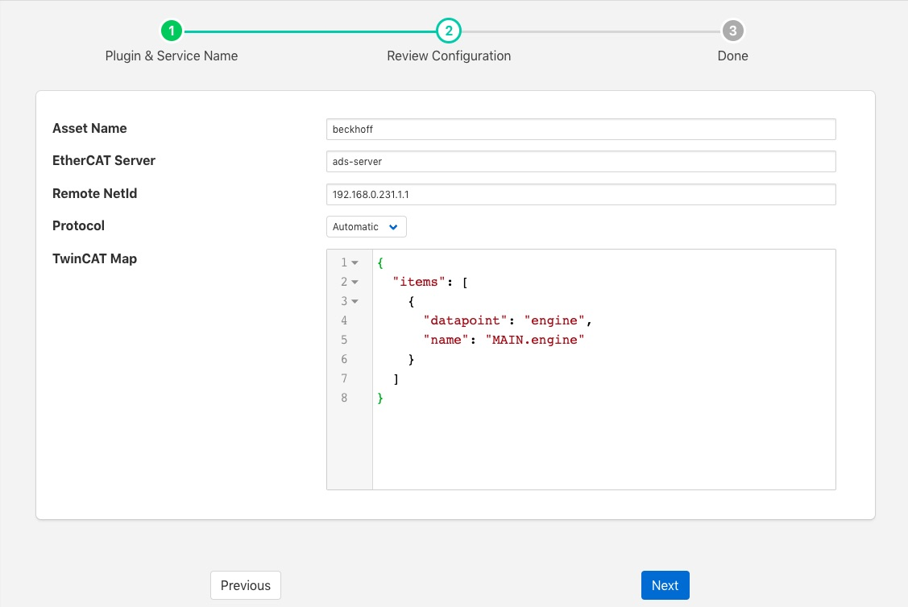

.. Images

Beckhoff TwinCAT
================

The *foglamp-south-beckhoff* plugin is a plugin that allows collection of data from Beckhoff PLC's using the TwinCAT 2 or TwinCAT 3 protocols. It utilises the ADS library to allow updates the the values held within the PLC to be captured in FogLAMP and sent onward as with any other data in FogLAMP.

The plugin uses a subscription model to register for changes to variables within the PLC and each of these becomes a data point in the asset that is created within FogLAMP.

To create a south service with the Beckhoff TwinCAT plugin

  - Click on *South* in the left hand menu bar

  - Select *Beckhoff* from the plugin list

  - Name your service and click *Next*

  +--------------+
  | |beckhoff_1| |
  +--------------+

  - Configure the plugin

    - **Asset Name**: The default asset name that is used for the data that is extracted from the PLC if the map does not define an explicit asset name.

    - **EtherCAT Server**: The hostname or IP address of the ADS maser, this is the IP address of the Beckhoff PLC.

    - **Remote NetId**: The Beckhoff netId of the PLC. This is normally the IP address of the PLC with .1.1 appended to it.

    - **Protocol**: Define if the Automatic, TwinCAT 2 or TwinCAT 3 protocol is to be used. If *Automatic* is chosen the plugin will attempt to determine if the PLC supports TwinCAT 2 or TwinCAT 3.

    - **TwinCAT Map**: A JSON document that is the data mapping for the PLC. This defines what variables are to be extracted from the PLC. See below for details of the map format.

Map Format
----------

The map is a JSON document that describes the variables to be extracted
from the PLC. The variables may be defined either by name or by group
and index id. Each variable will become a datapoint with the asset added
to FogLAMP. The map itself is a single JSON array called "items", with
each element in the array being an object that define the variable and
what to do with it.

These objects have the following members within them

+-----------+--------------------------------------------------------------------------+
| Key       | Description                                                              |
+===========+==========================================================================+
| asset     | An optional element that defines an asset code that should be used to    |
|           | store the variable. If this is not given then the default asset code     |
|           | for the plugin is used.                                                  |
+-----------+--------------------------------------------------------------------------+
| datapoint | The name of the datapoint into which the variable is stored within       |
|           | the asset code. The datapoint name must be given for each object in      |
|           | the map.                                                                 |
+-----------+--------------------------------------------------------------------------+
| name      | The variable name within the PLC that is extracted. This may be obtained |
|           | either by examining the PLC code that is running or by extracted from    |
|           | the .TPY file for the PLC. Either name or group and index must be        |
|           | given for each item in the map.                                          |
+-----------+--------------------------------------------------------------------------+
| group     | The numeric group within the PLC from which data is extracted. This      |
|           | allow data to be extracted without the use of variable names. It is not  |
|           | recommended for production use as it is very dependent on the layout of  |
|           | the PLC code, using variable names is more robust than group and index.  |
+-----------+--------------------------------------------------------------------------+
| index     | The numeric index within the group from which to extract data, see above.|
+-----------+--------------------------------------------------------------------------+

Example
~~~~~~~

An example TwinCAT map is should below

.. code-block:: JSON

  {
    "items": [
      {
        "datapoint": "engine",
        "name": "MAIN.engine"
      }
    ]
  }

This is based on the simulation that is available from Beckhoff and creates a single data point within the default asset called engine. It is populates with the value of the internal PLC variable *MAIN.engine*. A new asset will be created and added to the FogLAMP buffer every time this variable changes.

Testing
~~~~~~~

The easiest way to test the Beckhoff plugin is to setup a simulation
on a windows machine and run the Beckhoff PLC in simulator mode. The
Beckhoff PLC can be freely downloaded from the Beckhoff site.

.. code-block:: console

  https://beckhoff.co.uk/english/download/tc3-downloads.htm?id=1905053019883865

This is designed to be run on a Windows 7 machine.

You can then create some sample variables to try to link to.

Downloading the code from Beckhoff includes a simple example that can
be run that defines an engine variable, this is the example for which
the default configuration is setup for.

.. note::

   You will need to setup a static route in the Beckhoff PLC with the AMSNetId and IP address for the plugin and the type as TCP/IP.

