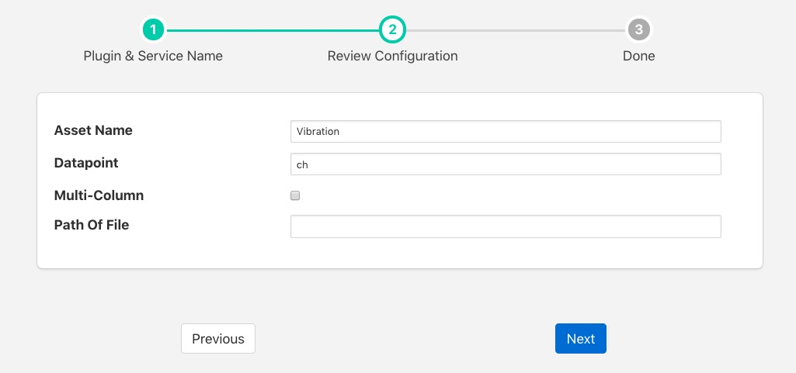

.. Images

Simple CSV Plugin
=================

The *foglamp-south-csv* plugin is a simple plugin for reading comma separated variable files and injecting them as if there were sensor data. There a are a number of variants of plugin that support this functionality with varying degrees of sophistication. These may also be considered as simple examples of how to write plugin code.

This particular CSV reader support single or multi-column CSV files, without timestamps in the file. It assumes every value is a data value. If the multi-column option is not set then it will read data from the file up until a newline or a comma character and make that as single data point in an asset and return that.

If the multi-column option is selected then each column in the CSV file becomes a data point within a single asset. It is assumed that every row of the CSV file will have the same number of values.

Upon reaching the end of the file the plugin will restart sending data from the beginning of the file.

To create a south service with the csv plugin

  - Click on *South* in the left hand menu bar

  - Select *Csv* from the plugin list

  - Name your service and click *Next*

  +---------+
  | |csv_1| |
  +---------+

  - Configure the plugin

    - **Asset Name**: The name of the asset that will be created

    - **Datapoint**: The name of the data point to insert. If multi-column is selected this becomes the prefix of the name, with the column number appended to create the full name

    - **Multi-Column**: If selected then each row of the CSV file is treated as a single asset with each column becoming a data point within that asset.

    - **Path Of File**: The file that should be read by the CSV plugin, this may be any location within the host operating system. The FogLAMP process should have permission to read this file.

  - Click *Next*

  - Enable the service and click on *Done*
