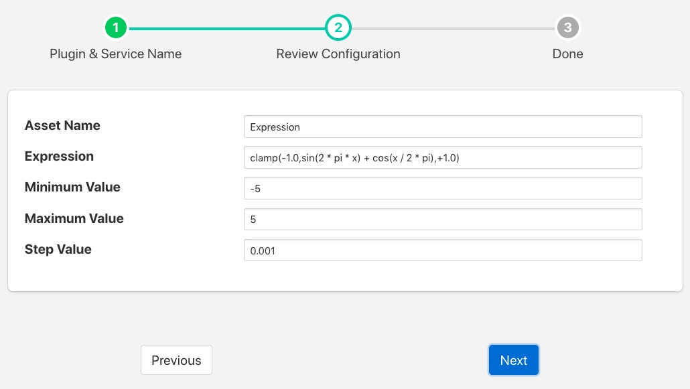

.. Images

.. |exprtk| raw:: html

   <a href="http://www.partow.net/programming/exprtk/index.html">ExprTk</a>

Expression South Plugin
=======================

The *foglamp-south-expression* plugin is a plugin that is used to generate synthetic data using a mathematical expression to generate data that changes over time. The user may configure the plugin with an expression of their choice and define a period in terms of samples put period of the output and the increment between each sample.

+----------------+
| |expression_1| |
+----------------+

The parameters that can be configured are;

  - **Asset Name**: The name of the asset to be created inside FogLAMP.
  - **Expression**: The expression that should be evaluated to create the asset value, see below.
  - **Minimum Value**: The minimum value of x, where x is the value that sweeps over time.
  - **Maximum Value**: The maximum value of x, where x is the value that sweeps over time.
  - **Step Value**: The step in x for each call to the expression evaluation.

Expression Support
------------------

The *foglamp-south-expression* plugin makes use of the |exprtk| library to do run time expression evaluation. This library provides a rich mathematical operator set, the most useful of these in the context of this plugin are;

  - Mathematical operators (+, -, \*, /, %, ^)

  - Functions (min, max, avg, sum, abs, ceil, floor, round, roundn, exp, log, log10, logn, pow, root, sqrt, clamp, inrange, swap)

  - Trigonometry (sin, cos, tan, acos, asin, atan, atan2, cosh, cot, csc, sec, sinh, tanh, d2r, r2d, d2g, g2d, hyp)

