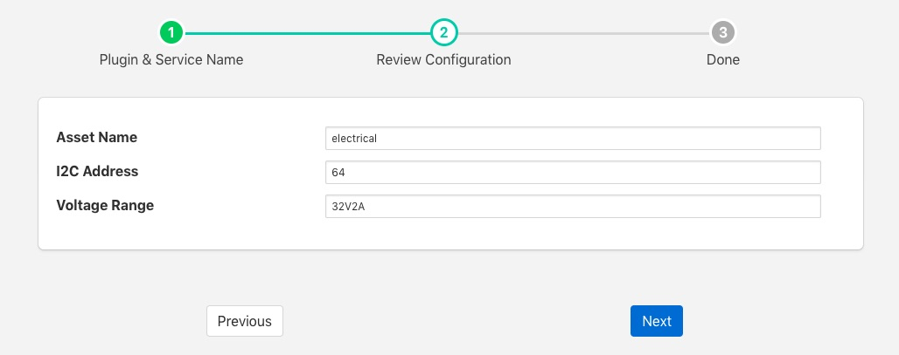
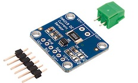

.. Images

INA219 Voltage & Current Sensor
===============================

The *foglamp-south-ina219* plugin is a south plugin that uses an INA219 breakout board to measure current and voltage. The Texas Instruments INA219 is capable of measuring voltages up to 26 volts and currents up to 3.2 Amps. It connects via the I2C bus of the host and multiple sensors may be daisy chain on a single I2C bus. Breakout boards that mount the chip and its associate shunt resistor and connectors and easily available and attached to hosts with I2C buses.

The INA219 support three voltage/current ranges

  - 32 Volts, 2 Amps

  - 32 Volts, 1 Amp

  - 16 Volts, 400 mAmps

Choosing the smallest range that is sufficient for your application will give you the best accuracy.

.. note::

   This plugin is only available for the Raspberry Pi as it requires to be interfaced to the I2C bus on the Raspberry Pi GPIO header socket.

To create a south service with the INA219

  - Click on *South* in the left hand menu bar

  - Select *ina219* from the plugin list

  - Name your service and click *Next*

  +------------+
  | |ina219_1| |
  +------------+

  - Configure the plugin

    - **Asset Name**: The asset name of the asst that will be written

    - **I2C Address**: The address of the INA219 device

    - **Voltage Range**: The voltage range that is to be used. This may be one of 32V2A, 32V1A or 16V400mA

  - Click *Next*

  - Enable the service and click on *Done*

Wiring The Sensor
-----------------

The INA219 uses the I2C bus on the Raspberry PI, which requires two wires to connect the bus, it also requires power taking the total to four wires

+-------------+-------------------+
|  INA219 Pin | Raspberry Pi Pin  |
+=============+===================+
| Vin         | 3V3 pin 1         |
+-------------+-------------------+
| GND         | GND pin 9         |
+-------------+-------------------+
| SDA         | SDA pin 3         |
+-------------+-------------------+
| SCL         | SCL pin 5         |
+-------------+-------------------+
