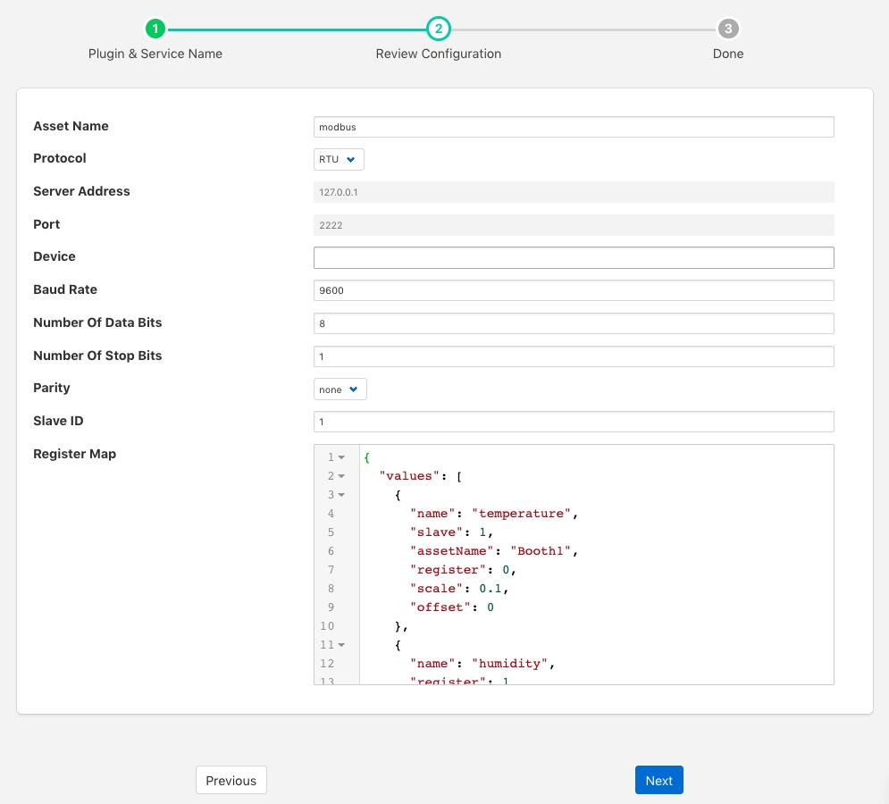

.. Images

Modbus South Plugin
===================

The *foglamp-south-modbus-c* plugin is a south plugin that supports both TCP and RTU variants of Modbus. The plugin provides support for reading Modbus coils, input bits, registers and input registers, a flexible mechanism is provided to create a mapping between the Modbus registers and coils and the assets within FogLAMP. Multiple registers can be combined to allow larger values that then register width to be mapped from devices that represent data in this way. Support is also included for floating point representation within the Modbus registers.

Configuration Parameters
------------------------

A Modbus south service is added in the same way as any other south service in FogLAMP, 

  - Select the *South* menu item

  - Click on the + icon in the top right

  - Select *ModbusC* from the plugin list

  - Enter a name for your Modbus service

  - Click *Next*

  - You will be presented with the following configuration page

+------------+
| |modbus_1| |
+------------+

    - **Asset Name**: This is the name of the asset that will be used for the data read by this service. You can override this within the Modbus Map, so this should be treated as the default if no override is given.

    - **Protocol**: This allows you to select either the *RTU* or *TCP* protocol. Modbus RTU is used whenever you have a serial connection, such as RS485 for connecting to you device. The TCP variant is used where you have a network connection to your device.

    - **Server Address**: This is the network address of your Modbus device and is only valid if you selected the *TCP* protocol.

    - **Port**: This is the port to use to connect to your Modbus device if you are using the TCP protocol.

    - **Device**: This is the device to open if you are using the RTU protocol. This would be the name of a Linux device in /dev, for example /dev/SERIAL0

    - **Baud Rate**: The baud rate used to communicate if you are using a serial connection with Modbus RTU.

    - **Number of Data Bits**: The number of data bits to send on serial connections.

    - **Number of Stop Bits**: The number of stop bits to send on the serial connections.

    - **Parity**: The parity setting to use on the serial connection.

    - **Slave ID**: The slave ID of the Modbus device from which you wish to pull data.

    - **Register Map**: The register map defines which Modbus registers and coils you read, and how to map them to FogLAMP assets. The map is a complex JSON object which is described in more detail below.

Register Map
~~~~~~~~~~~~

The register map is the most complex configuration parameter for this plugin and over time has supported a number of different variants. We will only document the latest of these here although previous variants are still supported. This latest variant is the most flexible to date and is thus the recommended approach to adopt.

The map is a JSON object with a single array *values*, each element of this array is a JSON object that defines a single item of data that will be stored in FogLAMP. These objects support a number of properties and values, these are

+---------------+-------------------------------------------------------------------------+
| Property      | Description                                                             |
+===============+=========================================================================+
| name          | The name of the value that we are reading. This becomes the name of the |
|               | data point with the asset. This may be either the default asset name    |
|               | defined plugin or an individual asset if an override is given.          |
+---------------+-------------------------------------------------------------------------+
| slave         | The Modbus slave ID of the device if it differs from the global Slave   |
|               | ID defined for the plugin. If not given the default Slave ID will be    |
|               | used.                                                                   |
+---------------+-------------------------------------------------------------------------+
| assetName     | This is an optional property that allows the asset name define for the  |
|               | plugin to be overridden on an individual basis. Multiple values in the  |
|               | values array may share the same AssetName, in which case the values     |
|               | read from the Modbus device are placed in the same asset.               |
+---------------+-------------------------------------------------------------------------+
| register      | This defines the Modbus register that is read. It may be a single       |
|               | register, it which case the value is the register number or it may be   |
|               | multiple registers in which case the value is a JSON array of numbers.  |
|               | If an array is given then the registers are read in the order of that   |
|               | array and combined into a single value by shifting each value up 16     |
|               | bits and performing a logical OR operation with the next register in    |
|               | the array.                                                              |
+---------------+-------------------------------------------------------------------------+
| coil          | This defines the number of the Modbus coil to read. Coils are single    |
|               | bit Modbus values.                                                      |
+---------------+-------------------------------------------------------------------------+
| input         | This defines the number of the Modbus discrete input. Coils are single  |
|               | bit Modbus values.                                                      |
+---------------+-------------------------------------------------------------------------+
| inputRegister | This defines the Modbus input register that is read. It may be a single |
|               | register, it which case the value is the register number or it may be   |
|               | multiple registers in which case the value is a JSON array of numbers.  |
|               | If an array is given then the registers are read in the order of that   |
|               | array and combined into a single value by shifting each value up 16     |
|               | bits and performing a logical OR operation with the next register in    |
|               | the array.                                                              |
+---------------+-------------------------------------------------------------------------+
| scale         | A scale factor to apply to the data that is read. The value read is     |
|               | multiplied by this scale. This is an optional property.                 |
+---------------+-------------------------------------------------------------------------+
| offset        | An optional offset to add to the value read from the Modbus device.     |
+---------------+-------------------------------------------------------------------------+
| type          | This allows data to be cast to a different type. The only support type  |
|               | currently is *float* and is used to interpret data read from the one or |
|               | more of the 16 bit registers as a floating point value. This property   |
|               | is optional.                                                            |
+---------------+-------------------------------------------------------------------------+
| swap          | This is an optional property used to byte swap values read from a       |
|               | Modbus device. It may be set to one of *bytes*, *words* or *both* to    |
|               | control the swapping to apply to bytes in a 16 bit value, 16 bit words  |
|               | in a 32 bit value or both bytes and words in 32 bit values.             |
+---------------+-------------------------------------------------------------------------+

Every *value* object in the *values* array must have one and only one of *coil*, *input*, *register* or *inputRegister* included as this defines the source of the data in your Modbus device. These are the Modbus object types and each has an address space within a typical Modbus device.

+------------------+---------+---------------+---------------+
| Object Type      | Size    | Address Space | Map Property  |
+==================+=========+===============+===============+
| Coil             | 1 bit   | 00001 - 09999 | coil          |
+------------------+---------+---------------+---------------+
| Discrete Input   | 1 bit   | 10001 - 19999 | input         |
+------------------+---------+---------------+---------------+
| Input Register   | 16 bits | 30001 - 39999 | inputRegister |
+------------------+---------+---------------+---------------+
| Holding Register | 16 bits | 40001 - 49999 | register      |
+------------------+---------+---------------+---------------+

The values in the map for coils, inputs and registers are relative to the base of the address space for that object type rather than the global address space and each is 0 based. A map value that has the property *"coil" : 10* would return the values of the tenth coil and *"register" : 10* would return the tenth register.

Example Maps
~~~~~~~~~~~~

In this example we will assume we have a cooling fan that has a Modbus interface and we want to extract three data items of interest. These items are

  - Current temperature that is in Modbus holding register 10
  
  - Current speed of the fan that is stored as a 32 bit value in Modbus holding registers 11 and 12

  - The active state of the fan that is stored in a Modbus coil 1

The Modbus Map for this example would be as follow:

.. code-block:: JSON

    {
        "values" : [
               {
                   "name"     : "temperature",
                   "register" : 10
               },
               {
                   "name"     : "speed",
                   "register" : [ 11, 12 ]
               },
               {
                   "name" : "active",
                   "coil" : 1
               }
            ]
    }

Since none of these values have an assetName defined all there values will be stored in a single asset, the name of which is the default asset name defined for the plugin as a whole. This asset will have three data points within it; *temperature*, *speed* and *active*.
