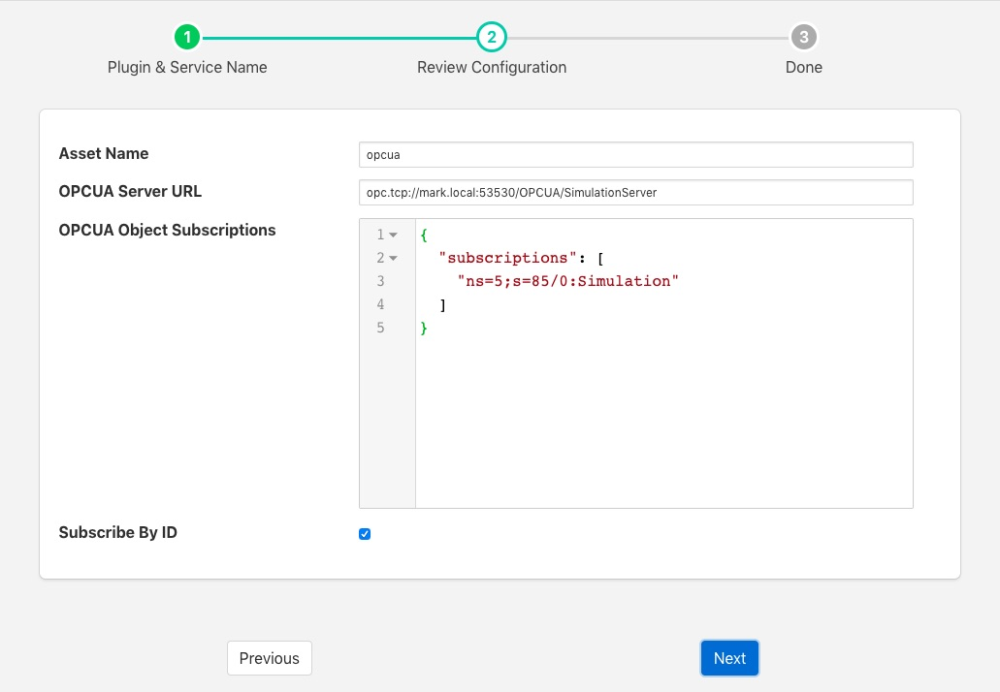

.. Images

.. |UaExpert| raw:: html

    <a href="https://www.unified-automation.com/downloads/opc-ua-clients.html">Ua Expert</a>

OPC/UA South Plugin
===================

The *foglamp-south-opcua* plugin allows FogLAMP to connect to an OPC/UA server and subscribe to changes in the objects within the OPC/UA server.

A south service to collect OPC/UA data is created in the same way as any other south service in FogLAMP.

  - Use the *South* option in the left hand menu bar to display a list of your South services

  - Click on the + add icon at the top right of the page

  - Select the OPCUA plugin from the list of plugins you are provided with

  - Enter a name for your south service

  - Click on *Next* to configure the OPC/UA plugin

+-----------+
| |opcua_1| |
+-----------+

The configuration parameters that can be set on this page are;

  - **Asset Name**: This is a prefix that will be applied to all assets that are created by this plugin. The OPC/UA plugin creates a separate asset for each data item read from the OPC/UA server. This is done since the OPC/UA server will deliver changes to individual data items only. Combining these into a complex asset would result in assets that do only contain one of many data points in each update. This can cause upstream systems problems with the every changing asset structure.

  - **OPCUA Server URL**: This is the URL of the OPC/UA server from which data will be extracted. The URL should be of the form opc.tcp://..../

  - **OPCUA Object Subscriptions**: The subscriptions are a set of locations in the OPC/UA object hierarchy that defined which data is subscribed to in the server and hence what assets get created within FogLAMP. A fuller description of how to configure subscriptions is shown below.

  - **Subscribe By ID**: This toggle determines if the OPC/UA objects in the subscription are using names to identify the objects in the OPC/UA object hierarchy or using object ID's.

Subscriptions
-------------

Subscriptions to OPC/UA objects are stored as a JSON object that contents an array named "subscriptions". This  array is a set of OPC/UA nodes that will control the subscription to variables in the OPC/UA server.

The array may be empty, in which case all variables are subscribed to in the server and will create assets in FogLAMP. Although simply subscribing to everything will return a lot of data that may not be of use.

If the *Subscribe By ID*  option is set then this is an array of node Id's. Each node Id should be of the form *ns=..;s=...* Where *ns* is a namespace index and *s* is the node id string identifier. A subscription will be created with the OPC/UA server for the object with the specified node id and its children, resulting in data change messages from the server for those objects. Each data change received from the server will create an asset in FogLAMP with the name of the object prepended by the value set for *Asset Name*.

If the *Subscribe By ID* option is not set then the array is an array of browse names. The format of the browse names is <namespace>:<name>. If the namespace is not required then the name can simply be given, in which case any name that matches in any namespace will have a subscription created. The plugin will traverse the node tree of the server from the *ObjectNodes* root and subscribe to all variables that live below the named nodes in the subscriptions array.

Configuration examples
~~~~~~~~~~~~~~~~~~~~~~

.. code-block:: console

    {"subscriptions":["5:Simulation","2:MyLevel"]}

We subscribe to

 - 5:Simulation is a node name under ObjectsNode in namespace 5

 - 2:MyLevel is a variable under ObjectsNode in namespace 2

.. code-block:: console

    {"subscriptions":["5:Sinusoid1","2:MyLevel","5:Sawtooth1"]}

We subscribe to

 - 5:Sinusoid1 and 5:Sawtooth1 are variables under ObjectsNode/Simulation in namespace 5

 - 2:MyLevel is a variable under ObjectsNode in namespace 2

.. code-block:: console

    {"subscriptions":["2:Random.Double","2:Random.Boolean"]}

We subscribe to

 - Random.Double and Random.Boolean are variables under ObjectsNode/Demo both in namespace 2

It's also possible to specify an empty subscription array:

.. code-block:: console

    {"subscriptions":[]}

.. note:: 
  Depending on OPC/UA server configuration (number of objects, number of variables) this empty configuration might take a long time to create the subscriptions and hence delay the startup of the south service. It will also result in a large number of assets being created within FogLAMP.

Object names, variable names and NamespaceIndexes can be easily retrieved browsing the given OPC/UA server using OPC UA clients, such as |UaExpert|.

