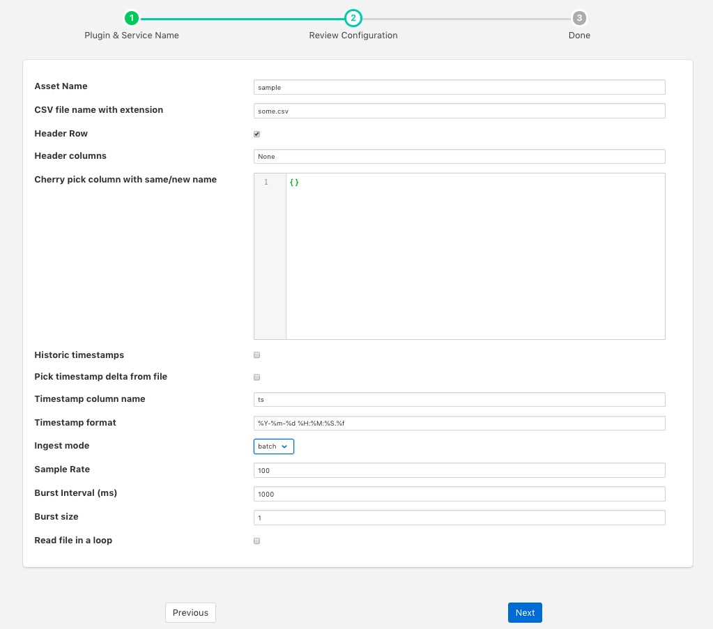

.. Images

Playback Plugin
===============

The *foglamp-south-playback* plugin is a feature rich plugin for playing back comma separated variable (CSV) files. It supports features such as;

  - Header rows

  - User defined column names

  - Use of historic or current timestamps

  - Multiple timestamp formats

  - Pick and optionally rename columns

  - Looped or single pass readings of the data

To create a south service with the playback plugin

  - Click on *South* in the left hand menu bar

  - Select *playback* from the plugin list

  - Name your service and click *Next*

  +---------------+
  | |playback_01| |
  +---------------+

  - Configure the plugin

    - **Asset Name**: An asset name to use for the content of the file.

    - **CSV file name with extension**: The name of the file that is to be processed, the file must be located in the FogLAMP data directory.

    - **Header Row**: Toggle to indicate the first row is a header row that contains the names that should be used for the data points within the asset.

    - **Header Columns**: Only used if *Header Row* is not enabled. This parameter should a column separated list of column names that will be used to name the data points within the asset.

    - **Cherry pick column with same/new name**: This is a JSON document that can define a set of columns to include and optionally names to give those columns. If left empty then all columns, are included.

    - **Historic timestamps**: A toggle field to control if the timestamp data should be the current time or a date and time taken from the file itself.

    - **Pick timestamp delta from file**: If current timestamps are used then this option can be used to maintain the same relative times between successive timestamps added to the data as it is ingested.

    - **Timestamp column name**: The name of the column that should be used for reading timestamp value. This must be given if either historic timestamps are used or the interval between readings is to be maintained.

    - **Timestamp format**: The format of the timestamp within the file.

    - **Ingest mode**: Determine if ingest should be in batch or burst mode. In burst mode data is ingested as a set of bursts of rows, defined by *Burst size*, every *Burst Interval*, this allows simulation if sensors that have internal buffering within them. Batch mode is the normal, regular rate ingest of data.

    - **Sample Rate**: The data sampling rate that should be used, this is defined in readings per second.

    - **Burst Interval (ms)**: The time interval between consecutive bursts when burst mode is used.

    - **Burst size**: The number of readings to be sent in each burst.

    - **Read file in a loop**: Once the end of the file is reached then the plugin will go back to the start and resend the data if this toggle is on.

  - Click *Next*

  - Enable the service and click on *Done*

Picking Columns
---------------

The *Cherry pick column with same/new name* entry is a JSON document with a set of key/value pairs. The key is the name of the column in the file and the value is the name which should appear in the final asset. To illustrate this let's assume we have a CSV file as follows

.. code-block:: console

   X,Y,Z,Amps,Volts
   1.3,0.1,0.3,2.1,240
   1.2,0.3,0.2,2.2,235
   ....

We want to create an asset that has the *X* and *Y* values, *Amps* and *Volts* but we want to name them *X*, *Y*, *Current*, *Voltage*. We can do this by creating a JSON document that maps the columns.

.. code-block:: console

   {
      "X" : "X",
      "Y" : "Y",
      "Amps" : "Current",
      "Volts" : "Voltage"
   }

Since we only mention the columns *X*, *Y*, *Amps* and *Volts*, only these will be included in the asset and we will not include the column *Z*. We map the column name *X* to *X*, so it will be unchanged. As will the column *Y*, the column *Amps* will become the data point *Current* and *Volts* will become *Voltage*.
