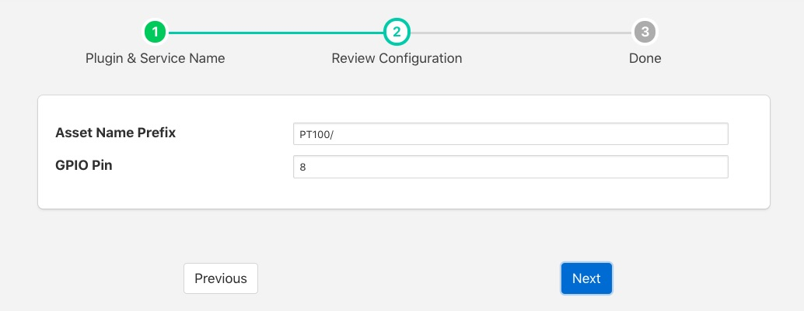
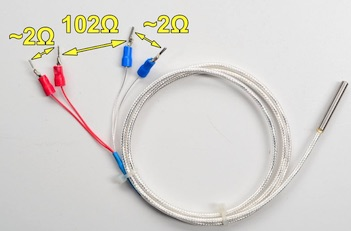
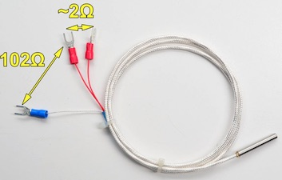
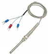
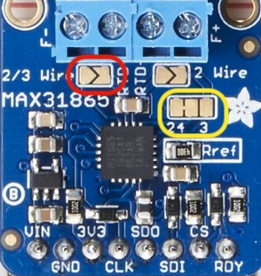

.. Images

PT100 Temperature Sensor
========================

The *foglamp-south-pt100* is a south plugin for the PT-100 temperature sensor. The PT100 is a resistance temperature detectors (RTDs) consist of a fine wire (typically platinum) wrapped around a ceramic core, exhibiting a linear increase in resistance as temperature rises. The sensor connects via a MAX31865 converter to a GPIO pins for I2C bus and a chip select pin.

.. note::

   This plugin is only available for the Raspberry Pi as it requires to be interfaced to the I2C bus on the Raspberry Pi GPIO header socket.

To create a south service with the PT100

  - Click on *South* in the left hand menu bar

  - Select *pt100* from the plugin list

  - Name your service and click *Next*

  +-----------+
  | |pt100_1| |
  +-----------+

  - Configure the plugin

    - **Asset Name Prefix**: A prefix to add to the asset name

    - **GPIO Pin**: The GPIO pin on the Raspberry PI to which the MAX31865 chip select  is connected.

  - Click *Next*

  - Enable the service and click on *Done*

Wiring The Sensor
-----------------

The MAX31865 uses the I2C bus on the Raspberry PI, which requires three wires to connect the bus, it also requires a chip select pin to be wired to a general GPIO pin and power.

+---------------+----------------------+
| MAX 31865 Pin | Raspberry Pi Pin     |
+===============+======================+
| Vin           | 3V3                  |
+---------------+----------------------+
| GND           | GND                  |
+---------------+----------------------+
| SDI           | MOSI                 |
+---------------+----------------------+
| SDO           | MISO                 |
+---------------+----------------------+
| CLK           | SCLK                 |
+---------------+----------------------+
| CS            | GPIO (default GPIO8) |
+---------------+----------------------+

There are two options for connecting a PT100 to the MAX31865, a three wire PT100 or a four wire PT100.

To connect a four wire PT100 to the MAX 31865 the wires are connected in pairs, the two red wires are connected to the RTD- connector pair on the MAX31865 and the two remaining wires are connected to the RTD+ connector pair. If your PT100 does not have red wires or you wish to verify the colours are correct use a multimeter to measures the resistance across the pair of wires. Each pair should show 2 ohms between them and the difference between the two pairs should be  102 ohms, but will vary with temperature.

To connect a three wire sensor connect the red pair of wires across the RTD+ pair of connectors and the third wire on the RTD- block. If your PT100 doe not have a pair of red wires, or you wish to verify the colours and have access to a multimeter, the resistance between the red wires should be 2 ohms. ~The resistance to the third wire, from the red pair, will be approximately 102 ohms but will vary with temperature.

If using the 3 wire sensor you must also modify the jumpers on the MAX31865.

Create a solder bridge across the *2/3 Wire* jumper, outlined in red in the picture above.

You must also cut the thin wire trace on the jumper block outlined in yellow that runs between the 2 and 4.

Then create a new connection between the 4 and 3 side of this jumper block. This is probably best done with a solder bridge.

.. raw:: html

    

