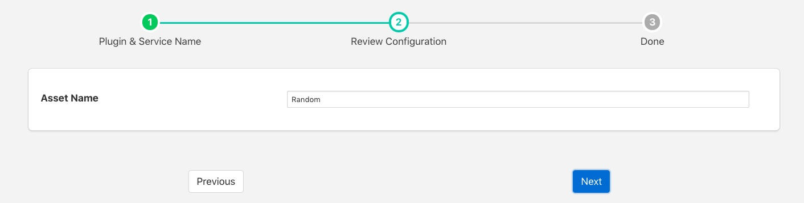

.. Images

Random
======

The *foglamp-south-random* plugin is a plugin that will create random data.

To create a south service with the Random plugin

  - Click on *South* in the left hand menu bar

  - Select *random* from the plugin list

  - Name your service and click *Next*

  +------------+
  | |random_1| |
  +------------+

  - Configure the plugin

    - **Asset name**: The name of the asset that will be created

  - Click *Next*

  - Enable the service and click on *Done*

