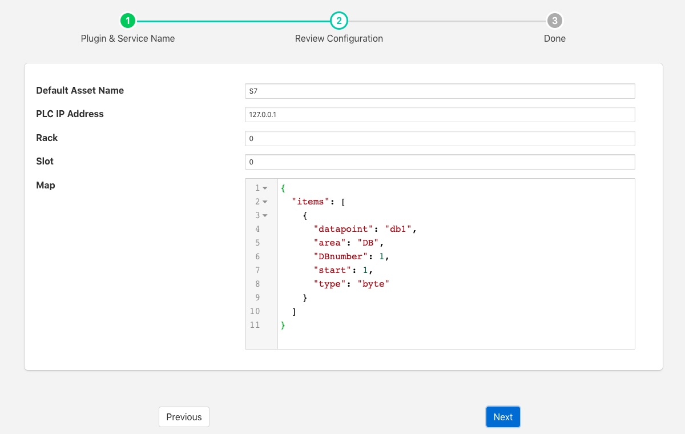
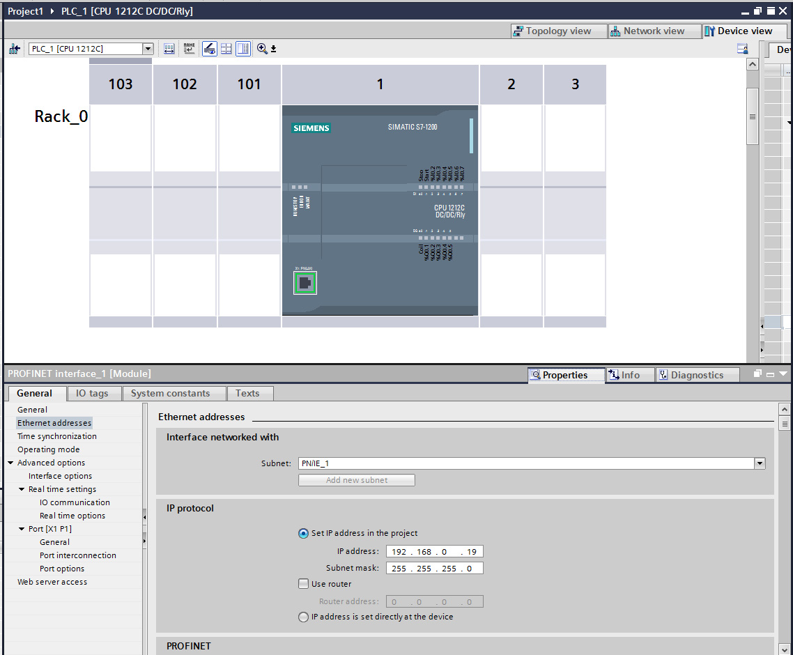
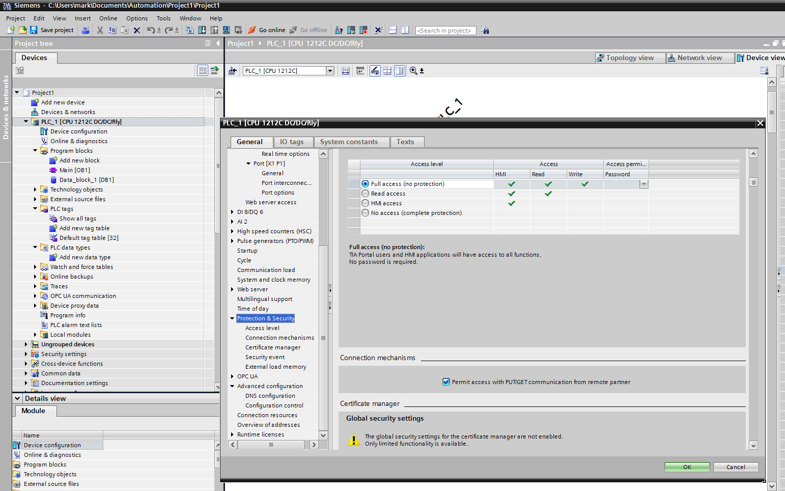
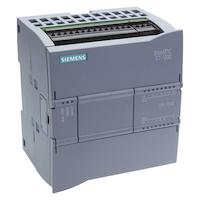

.. Images

.. |datablock| image:: images/datablock.jpg
                     

FogLAMP S7
=========

The *foglamp-south-s7* plugin is a south plugin that reads data from a Siemens S7 PLC using the S7 communication protocol. Data can be read from a number of sources within the PLC

  - Data blocks - The data blocks store the state of the PLC

  - Inputs - Read the state of the inputs to the PLC

  - Outputs - Read the state of the outputs from the PLC

  - Merkers - Read from the single bit flag store

  - Counters - Read a counter

  - Timers - Read a timer

Configuring the PLC
-------------------

There are a number of configuration steps that must be taken on the PLC itself to support the use of the S7 protocol.

Assigning an IP Address
~~~~~~~~~~~~~~~~~~~~~~~

Using the Siemens TIA console assign an IP address to your PLC. Connect to your PLC and locate the display of the PLC device. Double click on the network connector to bring up the properties for the network interface. 

+-----------+
| |Address| |
+-----------+

Assign an IP address to your interface and if you require it you may also assign a router to use.

Enable PUT/GET operations
~~~~~~~~~~~~~~~~~~~~~~~~~

The S7 1200 and 1500 series PLC's require the PUT/GET communication from partners to be enabled in order to retrieve data using the S7 protocol. To permit the PUT/GET network operations on your PLC use the Siemens VIA tool. Note you must be sure that you are offline when you do this. Locate you PLC in the tool and right click on the device select properties and the following dialog will be displayed.

The older S7-300 and S7-400 series do not require this to be done.

+----------+
| |GETPUT| |
+----------+

Select the protection tab and scroll down to find the checkbox that enables the use of GET/PUT operations. Make sure it is selected for your PLC.

Using the Plugin
----------------

To create a south service with the Siemens S7 plugin

  - Click on *South* in the left hand menu bar

  - Select *S7* from the plugin list

  - Name your service and click *Next*

  +------+
  | |s7| |
  +------+

  - Configure the plugin

     - **Default Asset Name**: The name of the asset to use if none is given in each of the data mapping items.

     - **PLC IP Address**: The IP address assigned to your PLC.

     - **Rack**: The rack number to address, usually this is 0 for a standalone PLC.

     - **Slot**: The slot within the rack, most CPU's are in slot 1 of the rack.

     - **Map**: The data mapping for the plugin. This tells the plugin what data to fetch from the PLC.

Map Format
----------

The data mapping uses a JSON document to define the data that should be read. The document is an array of items to read from the PLC, each item is a datapoint within either the default asset or it may be defined as a different asset within the item. An item contains a number of properties

  - **asset**: An optional property that can be used to put this item into an asset other than than one defined as the default asset for the service.

  - **datapoint**: The name of the data point that the data will be placed in. All items must have a datapoint defined.

  - **area**: The area in the PLC that data will be read from. There are a number of areas available

    - **PE**: Process Input - these are the inputs to the PLC

    - **PA**: Process Output - these are the outputs from the PLC

    - **MK**: Merker - a single bit memory used to store flags

    - **DB**: Data Block - the data blocks within the PLC used to store state within the PLC code

    - **CT**: Counter - The counters within the PLC

    - **TM**: Timer - The timers within the PLC

    You may use the abbreviated area name, e.g. *PA* or the longer name *Process Inputs* interchangeably in the map.

  - **DBnumber**: The data block number, this is only required for data blocks and is used to define the block to read.

  - **start**: The offset of the start of the item within the data block

  - **type**: The type of the data item to read. A number of different types are supported

    - **bit**: A single bit value, mostly used to retrieve the state of a digital input to the PLC

    - **byte**: A 8 bit integer value.

    - **word**: A 16 bit integer value.

    - **dword**: A 32 bit integer value.

    - **real**: A 32 bit floating point value.

    - **counter**: A 16 bit counter.

    - **timer**: a 16 bit timer.

 A simple data mapping that wanted to read the state of two digital inputs to the PLC, say DI0 and DI2, and wanted to labeled these as datapoints "Stop" and "Start" within the default asset  would consist of two items as follows

 .. code-block:: console

  {
     "items" : [
         {
             "datapoint": "Stop",
             "area": "PE",
             "start": 0,
             "type": "bit"
         },
         {
             "datapoint": "Start",
             "area": "PE",
             "start": 2,
             "type": "bit"
         },
      ]
    }

In this case we set start to 0 for DI0 as it is the first digital input in the set. DI2 has a start of 2 as it is the second input. We use the type of *bit* to return a simple 0 or 1 to indicate the state of the input. We could use *byte* instead, this would return the 8 inputs states encoded as a binary number.

.. code-block:: console

         {
             "datapoint": "Inputs",
             "area": "PE",
             "start": 0,
             "type": "byte"
         }

Since *start* is set to 0 and *type* is byte, then we return the state of the 8 inputs. We can do the same thing using the longer name form of the area as follows.

.. code-block:: console

         {
             "datapoint": "Inputs",
             "area": "Process Inputs",
             "start": 0,
             "type": "byte"
         }

To add in a digital output, say DO4 and label that running, we would add another item to the map

.. code-block:: console

        {
             "datapoint": "Running",
             "area": "PA",
             "start": 4,
             "type": "bit"
        }

If we assume we have a data block that we wish to read data from that appears as follows

+-------------+
| |datablock| |
+-------------+

Then we can setup a number of items in the map to retrieve these values and place them in data points. The items that would read this data block would be

.. code-block:: console

        {
             "datapoint": "count",
             "area": "DB",
             "DBnumber" : 1,
             "start": 0,
             "type": "word"
        },
        {
             "datapoint": "state",
             "area": "DB",
             "DBnumber" : 1,
             "start": 2,
             "type": "word"
        },
        {
             "datapoint": "failures",
             "area": "DB",
             "DBnumber" : 1,
             "start": 4,
             "type": "dword"
        },
        {
             "datapoint": "rate",
             "area": "DB",
             "DBnumber" : 1,
             "start": 8,
             "type": "word"
        },
        {
             "datapoint": "running",
             "area": "DB",
             "DBnumber" : 1,
             "start": 12,
             "type": "word"
        },
        {
             "datapoint": "downtime",
             "area": "DB",
             "DBnumber" : 1,
             "start": 14,
             "type": "timer"
        }

For clarity we have used the name in the data block as the datapoint name, but these need not be the same.

If there is an error in the map definition for a given item then that item is ignored and a message is written to the error log. For example if a bad area name is given

.. code-block:: console

  Jun 25 08:53:04 foglamp-18 FogLAMP S7[6121]: ERROR: Invalid area Data specified in device mapping for S7 db1-bad
  Jun 25 08:53:04 foglamp-18 FogLAMP S7[6121]: ERROR: Discarded invalid item in map for datapoint db1-bad

If a Data Block is missing it's DBnumber property then the following style of error will be produced.

.. code-block:: console

  Jun 25 08:39:07 foglamp-18 FogLAMP S7[6121]: ERROR: Missing data block number in map for S7, db1-bad. A data block number must be specified for a data block area read.
  Jun 25 08:39:07 foglamp-18 FogLAMP S7[6121]: ERROR: Discarded invalid item in map for datapoint db1-bad

Other errors that can occur include

.. code-block:: console

  Jun 25 08:57:28 foglamp-18 FogLAMP S7[6121]: ERROR: Missing start in map for datapoint db1-bad
  Jun 25 08:57:46 foglamp-18 FogLAMP S7[6121]: ERROR: Missing type in map for datapoint db1-bad

