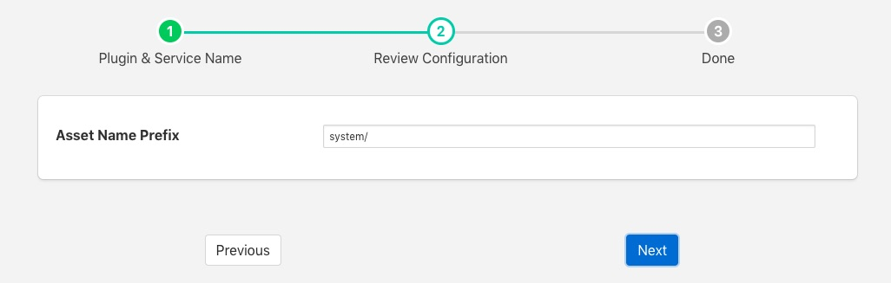
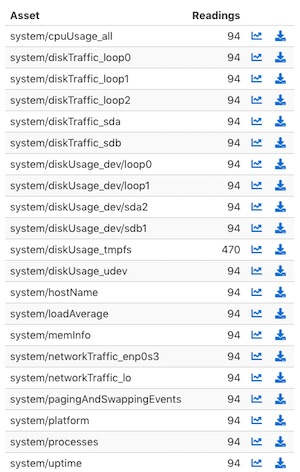
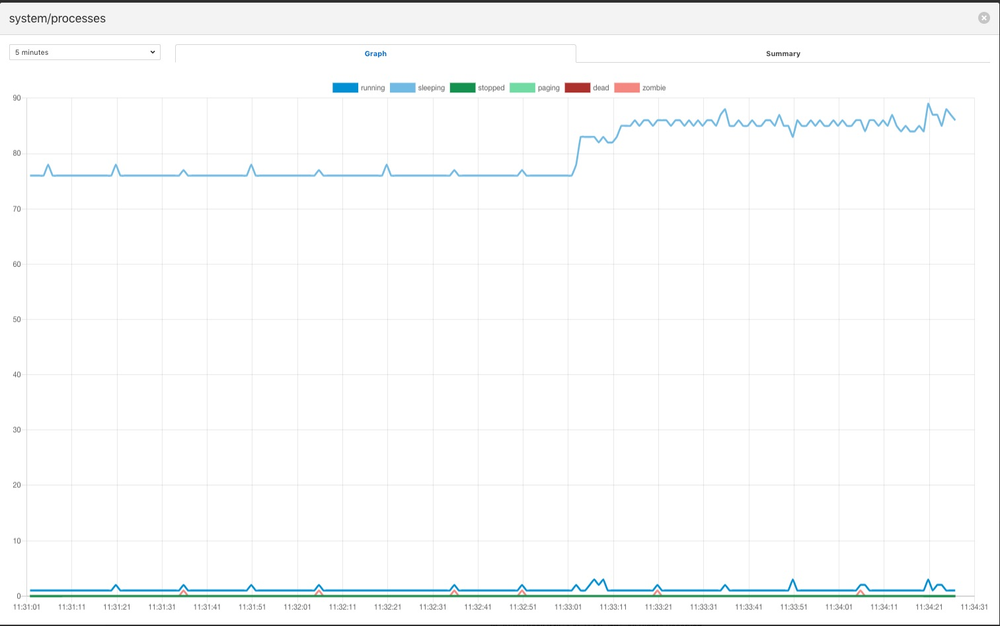

.. Images

System Information
==================

The *foglamp-south-systeminfo* plugin implements a that collects data about the machine that the FogLAMP instance is running on. The plugin is designed to allow the monitoring of the edge devices themselves to be included in the monitoring of the equipment involved in processing environment.

The plugin will create a number of assets, in general there are one or more assets per device connected in the case of disks and network interfaces. There are also some generic assets to measure;

  - CPU Usage

  - Host name

  - Load Average

  - Memory Usage

  - Paging and swapping

  - Process information

  - System Uptime

A typical output for one of these assets, in this case the processes asset is shown below

+----------------+
| |systeminfo_3| |
+----------------+

To create a south service with the systeminfo plugin

  - Click on *South* in the left hand menu bar

  - Select *systeminfo* from the plugin list

  - Name your service and click *Next*

  +----------------+
  | |systeminfo_1| |
  +----------------+

  - Configure the plugin

    - **Asset Name Prefix**: The asset name prefix for the assets created by this plugin. The plugin will create a number of assets, the exact number is dependent on the number of devices attached to the machine.

  - Click *Next*

  - Enable the service and click on *Done*

